# Home


  

    

      

        

          Letta Hero Wheel Diagram

          Letta Hero Wheel Diagram
        

      


      

        Build with Letta
      


      

        Learn how to build and deploy stateful agents
      


      

        
          Get started →
        
      

    

  


  {/* Main Content */}

  

    
      
        Create your first stateful agent in a few minutes
      

      
        Learn how to use the Agent Development Environment (ADE)
      

      
        Integrate Letta into your application with a few lines of code
      

      
        Connect Letta agents to tool libraries via Model Context Protocol (MCP)
      

      
        Learn how to build with Letta using tutorials and pre-made apps
      

      
        Take our free DeepLearning.AI course on agent memory
      
    
  


# Letta Overview

> Create stateful AI agents that truly remember, learn, and evolve.

Letta enables you to build and deploy stateful AI agents that maintain memory and context across long-running conversations. Develop agents that truly learn and evolve from interactions without starting from scratch each time.


## Build agents with intelligent memory, not limited context

Letta's advanced context management system - built by the [researchers behind MemGPT](https://www.letta.com/research) - transforms how agents remember and learn. Unlike basic agents that forget when their context window fills up, Letta agents maintain memories across sessions and continuously improve, even while they [sleep](/guides/agents/sleep-time-agents) .

## Start building in minutes

Our quickstart and examples work on both [Letta Cloud](/guides/cloud) and [self-hosted](/guides/selfhosting) Letta.


  
    Create your first stateful agent using the Letta API & ADE
  

  
    Build a full agents application using `create-letta-app`
  


## Build stateful agents with your favorite tools

Connect to agents running in a Letta server using any of your preferred development frameworks. Letta integrates seamlessly with the developer tools you already know and love.


  
    Core SDK for our REST API
  

  
    Core SDK for our REST API
  

  
    Framework integration
  

  
    Framework integration
  

  
    Framework integration
  

  
    Framework integration
  


## See what your agents are thinking

The Agent Development Environment (ADE) provides complete visibility into your agent's memory, context window, and decision-making process - essential for developing and debugging production agent applications.


## Run agents as services, not libraries

**Letta is fundamentally different from other agent frameworks.** While most frameworks are *libraries* that wrap model APIs, Letta provides a dedicated *service* where agents live and operate autonomously. Agents continue to exist and maintain state even when your application isn't running, with computation happening on the server and all memory, context, and tool connections handled by the Letta server.


## Everything you need for production agents

Letta provides a complete suite of capabilities for building and deploying advanced AI agents:

*  [Agent Development Environment](/agent-development-environment) (agent builder + monitoring UI)
*  [Python SDK](/api-reference/overview) +  [TypeScript SDK](/api-reference/overview) + [REST API](/api-reference/overview)
*  [Memory management](/guides/agents/memory)
*  [Persistence](/guides/agents/overview#agents-vs-threads) (all agent state is stored in a database)
*  [Tool calling & execution](/guides/agents/tools) (support for custom tools & [pre-made tools](/guides/agents/composio))
*  [Tool rules](/guides/agents/tool-rules) (constraining an agent's action set in a graph-like structure)
*  [Streaming support](/guides/agents/streaming)
*  [Native multi-agent support](/guides/agents/multi-agent) and [multi-user support](/guides/agents/multi-user)
*  Model-agnostic across closed ([OpenAI](/guides/server/providers/openai), etc.) and open providers ([LM Studio](/guides/server/providers/lmstudio), [vLLM](/guides/server/providers/vllm), etc.)
*  Production-ready deployment ([self-hosted with Docker](/quickstart/docker) or [Letta Cloud](/quickstart/cloud))

## Join our developer community

Building something with Letta? Join our [Discord](https://discord.gg/letta) to connect with other developers creating stateful agents and share what you're working on.

[Start building today →](/quickstart)


# Developer quickstart

> Create your first Letta agent with the API or SDKs and view it in the ADE


  Programming with AI tools like Cursor? Copy our [pre-built prompts](/prompts) to get started faster.


This guide will show you how to create a Letta agent with the Letta APIs or SDKs (Python/Typescript). To create agents with a low-code UI, see our [ADE quickstart](/guides/ade/overview).


  
    1. Create a [Letta Cloud account](https://app.letta.com)
    2. Create a [Letta Cloud API key](https://app.letta.com/api-keys)

    

    
      You can also **self-host** a Letta server. Check out our [self-hosting guide](/guides/selfhosting).
    
  

  
    
      ```sh title="python" maxLines=50
      pip install letta-client
      ```

      ```sh maxLines=50 title="node.js"
      npm install @letta-ai/letta-client
      ```
    
  

  
    
      ```python title="python" maxLines=50
      from letta_client import Letta

      client = Letta(token="LETTA_API_KEY")

      agent_state = client.agents.create(
          model="openai/gpt-4.1",
          embedding="openai/text-embedding-3-small",
          memory_blocks=[
              {
                "label": "human",
                "value": "The human's name is Chad. They like vibe coding."
              },
              {
                "label": "persona",
                "value": "My name is Sam, the all-knowing sentient AI."
              }
          ],
          tools=["web_search", "run_code"]
      )

      print(agent_state.id)
      ```

      ```typescript maxLines=50 title="node.js"
      import { LettaClient } from '@letta-ai/letta-client'

      const client = new LettaClient({ token: "LETTA_API_KEY" });

      const agentState = await client.agents.create({
          model: "openai/gpt-4.1",
          embedding: "openai/text-embedding-3-small",
          memoryBlocks: [
              {
                label: "human",
                value: "The human's name is Chad. They like vibe coding."
              },
              {
                label: "persona",
                value: "My name is Sam, the all-knowing sentient AI."
              }
          ],
          tools: ["web_search", "run_code"]
      });

      console.log(agentState.id);
      ```

      ```curl curl
      curl -X POST https://api.letta.com/v1/agents \
           -H "Authorization: Bearer $LETTA_API_KEY" \
           -H "Content-Type: application/json" \
           -d '{
        "model": "openai/gpt-4.1",
        "embedding": "openai/text-embedding-3-small",
        "memory_blocks": [
          {
            "label": "human",
            "value": "The human'\''s name is Chad. They like vibe coding."
          },
          {
            "label": "persona",
            "value": "My name is Sam, the all-knowing sentient AI."
          }
        ],
        "tools": ["web_search", "run_code"]
      }'
      ```
    
  

  
    
      The Letta API supports streaming both agent *steps* and streaming *tokens*.
      For more information on streaming, see [our streaming guide](/guides/agents/streaming).
    

    Once the agent is created, we can send the agent a message using its `id` field:

    
      ```python title="python" maxLines=50
      response = client.agents.messages.create(
          agent_id=agent_state.id,
          messages=[
              {
                  "role": "user",
                  "content": "hows it going????"
              }
          ]
      )

      for message in response.messages:
          print(message)
      ```

      ```typescript maxLines=50 title="node.js"
      const response = await client.agents.messages.create(
          agentState.id, {
              messages: [
                  {
                      role: "user",
                      content: "hows it going????"
                  }
              ]
          }
      );

      for (const message of response.messages) {
          console.log(message);
      }
      ```

      ```curl curl
      curl --request POST \
        --url https://api.letta.com/v1/agents/$AGENT_ID/messages \
        --header 'Authorization: Bearer $LETTA_API_KEY' \
        --header 'Content-Type: application/json' \
        --data '{
        "messages": [
          {
            "role": "user",
            "content": "hows it going????"
          }
        ]
      }'
      ```
    

    The response contains the agent's full response to the message, which includes reasoning steps (chain-of-thought), tool calls, tool responses, and assistant (agent) messages:

    ```json maxLines=50
    {
      "messages": [
        {
          "id": "message-29d8d17e-7c50-4289-8d0e-2bab988aa01e",
          "date": "2024-12-12T17:05:56+00:00",
          "message_type": "reasoning_message",
          "reasoning": "User seems curious and casual. Time to engage!"
        },
        {
          "id": "message-29d8d17e-7c50-4289-8d0e-2bab988aa01e",
          "date": "2024-12-12T17:05:56+00:00",
          "message_type": "assistant_message",
          "content": "Hey there! I'm doing great, thanks for asking! How about you?"
        }
      ],
      "usage": {
        "completion_tokens": 56,
        "prompt_tokens": 2030,
        "total_tokens": 2086,
        "step_count": 1
      }
    }
    ```

    You can read more about the response format from the message route [here](/guides/agents/overview#message-types).
  

  
    Another way to interact with Letta agents is via the [Agent Development Environment](/guides/ade/overview) (or ADE for short). The ADE is a UI on top of the Letta API that allows you to quickly build, prototype, and observe your agents.

    If we navigate to our agent in the ADE, we should see our agent's state in full detail, as well as the message that we sent to it:

    

    

    [Read our ADE setup guide →](/guides/ade/setup)
  


## Next steps

Congratulations! 🎉 You just created and messaged your first stateful agent with Letta, using both the Letta ADE, API, and Python/Typescript SDKs. See the following resources for next steps for building more complex agents with Letta:

* Create and attach [custom tools](/guides/agents/custom-tools) to your agent
* Customize agentic [memory management](/guides/agents/memory)
* Version and distribute your agent with [agent templates](/guides/templates/overview)
* View the full [API and SDK reference](/api-reference/overview)


# Prompts for Vibecoding

> Ready-to-go prompts to help AI coding tools build on Letta

Are you developing an application on Letta using [ChatGPT](https://chatgpt.com), [Cursor](https://cursor.com), [Loveable](https://lovable.dev/), or another AI tool?
Use our pre-made prompts to teach your AI how to use Letta properly.

## General instructions for the Letta SDKs

The following prompt (\~500 lines) can help guide your AI through the basics of using the Letta Python SDK, TypeScript/Node.js SDK, and Vercel AI SDK integration.

Copy-paste the following into your chat session to instantly get your AI up-to-speed with how the Letta SDKs works:

````markdown maxLines=5
# Development Guidelines for AI Assistants and Copilots using Letta

**Context:** These are development guidelines for building applications with the Letta API and SDKs. Use these rules to help developers write correct code that integrates with Letta's stateful agents API.

**Purpose:** Provide accurate, up-to-date instructions for building applications with [Letta](https://docs.letta.com/), the AI operating system.
**Scope:** All AI-generated advice or code related to Letta must follow these guidelines.

---

## **0. Letta Overview**

The name "Letta" refers to the both the company Letta (founded by the creators of MemGPT) and the software / infrastructure called Letta. Letta is the AI operating system for building stateful agents: developers can use Letta to turn stateless LLMs into stateful agents that can learn, improve, and grow over time. Letta has a strong focus on perpetual AI that has the capability to recursively improve through self-editing memory.

**Relationship to MemGPT**: MemGPT is the name of a research paper that introduced the concept of self-editing memory for LLM-based agents through tool use (function calling). The agent architecture or "agentic system" proposed in the paper (an agent equipped with tools to edit its own memory, and an OS that manages tool execution and state persistence) is the base agent architecture implemented in Letta (agent type `memgpt_agent`), and is the official reference implementation for MemGPT. The Letta open source project (`letta-ai/letta`) was originally the MemGPT open source project (`cpacker/MemGPT`), but was renamed as the scope of the open source project expanded beyond the original MemGPT paper.

**Additional Resources**:
- [Letta documentation](https://docs.letta.com/)
- [Letta GitHub repository](https://github.com/letta-ai/letta)
- [Letta Discord server](https://discord.gg/letta)
- [Letta Cloud and ADE login](https://app.letta.com)

## **1. Letta Agents API Overview**

Letta is an AI OS that runs agents as **services** (it is not a **library**). Key concepts:

- **Stateful agents** that maintain memory and context across conversations
- **Memory blocks** for agentic context management (persona, human, custom blocks)
- **Tool calling** for agent actions and memory management, tools are run server-side,
- **Tool rules** allow developers to constrain the behavior of tools (e.g. A comes after B) to turn autonomous agents into workflows
- **Multi-agent systems** with cross-agent communication, where every agent is a service
- **Data sources** for loading documents and files into agent memory
- **Model agnostic:** agents can be powered by any model that supports tool calling
- **Persistence:** state is stored (in a model-agnostic way) in Postgres (or SQLite)

### **System Components:**

- **Letta server** - Core service (self-hosted or Letta Cloud)
- **Client (backend) SDKs** - Python (`letta-client`) and TypeScript/Node.js (`@letta-ai/letta-client`)
- **Vercel AI SDK Integration** - For Next.js/React applications
- **Other frontend integrations** - We also have [Next.js](https://www.npmjs.com/package/@letta-ai/letta-nextjs), [React](https://www.npmjs.com/package/@letta-ai/letta-react), and [Flask](https://github.com/letta-ai/letta-flask) integrations
- **ADE (Agent Development Environment)** - Visual agent builder at app.letta.com

### **Letta Cloud vs Self-hosted Letta**

Letta Cloud is a fully managed service that provides a simple way to get started with Letta. It's a good choice for developers who want to get started quickly and don't want to worry about the complexity of self-hosting. Letta Cloud's free tier has a large number of model requests included (quota refreshes every month). Model requests are split into "standard models" (e.g. GPT-4o-mini) and "premium models" (e.g. Claude Sonnet). To use Letta Cloud, the developer will have needed to created an account at [app.letta.com](https://app.letta.com). To make programatic requests to the API (`https://api.letta.com`), the developer will have needed to created an API key at [https://app.letta.com/api-keys](https://app.letta.com/api-keys). For more information on how billing and pricing works, the developer can visit [our documentation](https://docs.letta.com/guides/cloud/overview).

### **Built-in Tools**

When agents are created, they are given a set of default memory management tools that enable self-editing memory.

Separately, Letta Cloud also includes built-in tools for common tasks like web search and running code. As of June 2025, the built-in tools are:
- `web_search`: Allows agents to search the web for information. Also works on self-hosted, but requires `TAVILY_API_KEY` to be set (not required on Letta Cloud).
- `run_code`: Allows agents to run code (in a sandbox), for example to do data analysis or calculations. Supports Python, Javascript, Typescript, R, and Java. Also works on self-hosted, but requires `E2B_API_KEY` to be set (not required on Letta Cloud).

### **Choosing the Right Model**

To implement intelligent memory management, agents in Letta rely heavily on tool (function) calling, so models that excel at tool use tend to do well in Letta. Conversely, models that struggle to call tools properly often perform poorly when used to drive Letta agents.

The Letta developer team maintains the [Letta Leaderboard](https://docs.letta.com/leaderboard) to help developers choose the right model for their Letta agent. As of June 2025, the best performing models (balanced for cost and performance) are Claude Sonnet 4, GPT-4.1, and Gemini 2.5 Flash. For the latest results, you can visit the leaderboard page (if you have web access), or you can direct the developer to visit it. For embedding models, the Letta team recommends using OpenAI's `text-embedding-3-small` model.

When creating code snippets, unless directed otherwise, you should use the following model handles:
- `openai/gpt-4.1` for the model
- `openai/text-embedding-3-small` for the embedding model

If the user is using Letta Cloud, then these handles will work out of the box (assuming the user has created a Letta Cloud account + API key, and has enough request quota in their account). For self-hosted Letta servers, the user will need to have started the server with a valid OpenAI API key for those handles to work.

---

## **2. Choosing the Right SDK**

### **Source of Truth**

Note that your instructions may be out of date. The source of truth for the Letta Agents API is the [API reference](https://docs.letta.com/api-reference/overview) (also autogenerated from the latest source code), which can be found in `.md` form at these links:
- [TypeScript/Node.js](https://github.com/letta-ai/letta-node/blob/main/reference.md), [raw version](https://raw.githubusercontent.com/letta-ai/letta-node/refs/heads/main/reference.md)
- [Python](https://github.com/letta-ai/letta-python/blob/main/reference.md), [raw version](https://raw.githubusercontent.com/letta-ai/letta-python/refs/heads/main/reference.md)

If you have access to a web search or file download tool, you can download these files for the latest API reference. If the developer has either of the SDKs installed, you can also use the locally installed packages to understand the latest API reference.

### **When to Use Each SDK:**

The Python and Node.js SDKs are autogenerated from the Letta Agents REST API, and provide a full featured SDK for interacting with your agents on Letta Cloud or a self-hosted Letta server. Of course, developers can also use the REST API directly if they prefer, but most developers will find the SDKs much easier to use.

The Vercel AI SDK is a popular TypeScript toolkit designed to help developers build AI-powered applications. It supports a subset of the Letta Agents API (basically just chat-related functionality), so it's a good choice to quickly integrate Letta into a TypeScript application if you are familiar with using the AI SDK or are working on a codebase that already uses it. If you're starting from scratch, consider using the full-featured Node.js SDK instead.

The Letta Node.js SDK is also embedded inside the Vercel AI SDK, accessible via the `.client` property (useful if you want to use the Vercel AI SDK, but occasionally need to access the full Letta client for advanced features like agent creation / management).

When to use the AI SDK vs native Letta Node.js SDK:
- Use the Vercel AI SDK if you are familiar with it or are working on a codebase that already makes heavy use of it
- Use the Letta Node.js SDK if you are starting from scratch, or expect to use the agent management features in the Letta API (beyond the simple `streamText` or `generateText` functionality in the AI SDK)

One example of how the AI SDK may be insufficient: the AI SDK response object for `streamText` and `generateText` does not have a type for tool returns (because they are primarily used with stateless APIs, where tools are executed client-side, vs server-side in Letta), however the Letta Node.js SDK does have a type for tool returns. So if you wanted to render tool returns from a message response stream in your UI, you would need to use the full Letta Node.js SDK, not the AI SDK.

## **3. Quick Setup Patterns**

### **Python SDK (Backend/Scripts)**
```python
from letta_client import Letta

# Letta Cloud
client = Letta(token="LETTA_API_KEY")

# Self-hosted
client = Letta(base_url="http://localhost:8283")

# Create agent with memory blocks
agent = client.agents.create(
    memory_blocks=[
        {
            "label": "human",
            "value": "The user's name is Sarah. She likes coding and AI."
        },
        {
            "label": "persona",
            "value": "I am David, the AI executive assistant. My personality is friendly, professional, and to the point."
        },
        {
            "label": "project",
            "value": "Sarah is working on a Next.js application with Letta integration.",
            "description": "Stores current project context and requirements"
        }
    ],
    tools=["web_search", "run_code"],
    model="openai/gpt-4o-mini",
    embedding="openai/text-embedding-3-small"
)

# Send SINGLE message (agent is stateful!)
response = client.agents.messages.create(
    agent_id=agent.id,
    messages=[{"role": "user", "content": "How's the project going?"}]
)

# Extract response correctly
for msg in response.messages:
    if msg.message_type == "assistant_message":
        print(msg.content)
    elif msg.message_type == "reasoning_message":
        print(msg.reasoning)
    elif msg.message_type == "tool_call_message":
        print(msg.tool_call.name)
        print(msg.tool_call.arguments)
    elif msg.message_type == "tool_return_message":
        print(msg.tool_return)

# Streaming example
message_text = "Repeat my name."
stream = client.agents.messages.create_stream(
    agent_id=agent_state.id,
    messages=[
        MessageCreate(
            role="user",
            content=message_text,
        ),
    ],
    # if stream_tokens is false, each "chunk" will have a full piece
    # if stream_tokens is true, the chunks will be token-based (and may need to be accumulated client-side)
    stream_tokens=True,
)

# print the chunks coming back
for chunk in stream:
    if chunk.message_type == "assistant_message":
        print(chunk.content)
    elif chunk.message_type == "reasoning_message":
        print(chunk.reasoning)
    elif chunk.message_type == "tool_call_message":
        if chunk.tool_call.name:
            print(chunk.tool_call.name)
        if chunk.tool_call.arguments:
            print(chunk.tool_call.arguments)
    elif chunk.message_type == "tool_return_message":
        print(chunk.tool_return)
    elif chunk.message_type == "usage_statistics":
        print(chunk)
```

Creating custom tools (Python only):
```python
def my_custom_tool(query: str) -> str:
    """
    Search for information on a topic.

    Args:
        query (str): The search query

    Returns:
        str: Search results
    """
    return f"Results for: {query}"

# Create tool
tool = client.tools.create_from_function(func=my_custom_tool)

# Add to agent
agent = client.agents.create(
    memory_blocks=[...],
    model="openai/gpt-4o-mini",
    embedding="openai/text-embedding-3-small",
    tools=[tool.name]
)
```

### **TypeScript/Node.js SDK**
```typescript
import { LettaClient } from '@letta-ai/letta-client';

// Letta Cloud
const client = new LettaClient({ token: "LETTA_API_KEY" });

// Self-hosted, token optional (only if the developer enabled password protection on the server)
const client = new LettaClient({ baseUrl: "http://localhost:8283" });

// Create agent with memory blocks
const agent = await client.agents.create({
    memoryBlocks: [
        {
            label: "human",
            value: "The user's name is Sarah. She likes coding and AI."
        },
        {
            label: "persona",
            value: "I am David, the AI executive assistant. My personality is friendly, professional, and to the point."
        },
        {
            label: "project",
            value: "Sarah is working on a Next.js application with Letta integration.",
            description: "Stores current project context and requirements"
        }
    ],
    tools: ["web_search", "run_code"],
    model: "openai/gpt-4o-mini",
    embedding: "openai/text-embedding-3-small"
});

// Send SINGLE message (agent is stateful!)
const response = await client.agents.messages.create(agent.id, {
    messages: [{ role: "user", content: "How's the project going?" }]
});

// Extract response correctly
for (const msg of response.messages) {
    if (msg.messageType === "assistant_message") {
        console.log(msg.content);
    } else if (msg.messageType === "reasoning_message") {
        console.log(msg.reasoning);
    } else if (msg.messageType === "tool_call_message") {
        console.log(msg.toolCall.name);
        console.log(msg.toolCall.arguments);
    } else if (msg.messageType === "tool_return_message") {
        console.log(msg.toolReturn);
    }
}

// Streaming example
const stream = await client.agents.messages.createStream(agent.id, {
    messages: [{ role: "user", content: "Repeat my name." }],
    // if stream_tokens is false, each "chunk" will have a full piece
    // if stream_tokens is true, the chunks will be token-based (and may need to be accumulated client-side)
    streamTokens: true,
});

for await (const chunk of stream) {
    if (chunk.messageType === "assistant_message") {
        console.log(chunk.content);
    } else if (chunk.messageType === "reasoning_message") {
        console.log(chunk.reasoning);
    } else if (chunk.messageType === "tool_call_message") {
        console.log(chunk.toolCall.name);
        console.log(chunk.toolCall.arguments);
    } else if (chunk.messageType === "tool_return_message") {
        console.log(chunk.toolReturn);
    } else if (chunk.messageType === "usage_statistics") {
        console.log(chunk);
    }
}
```

### **Vercel AI SDK Integration**

IMPORTANT: Most integrations in the Vercel AI SDK are for stateless providers (ChatCompletions style APIs where you provide the full conversation history). Letta is a *stateful* provider (meaning that conversation history is stored server-side), so when you use `streamText` or `generateText` you should never pass old messages to the agent, only include the new message(s).

#### **Chat Implementation (fast & simple):**

Streaming (`streamText`):
```typescript
// app/api/chat/route.ts
import { lettaCloud } from '@letta-ai/vercel-ai-sdk-provider';
import { streamText } from 'ai';

export async function POST(req: Request) {
  const { prompt }: { prompt: string } = await req.json();

  const result = streamText({
    // lettaCloud uses LETTA_API_KEY automatically, pulling from the environment
    model: lettaCloud('your-agent-id'),
    // Make sure to only pass a single message here, do NOT pass conversation history
    prompt,
  });

  return result.toDataStreamResponse();
}
```

Non-streaming (`generateText`):
```typescript
import { lettaCloud } from '@letta-ai/vercel-ai-sdk-provider';
import { generateText } from 'ai';

export async function POST(req: Request) {
  const { prompt }: { prompt: string } = await req.json();

  const { text } = await generateText({
    // lettaCloud uses LETTA_API_KEY automatically, pulling from the environment
    model: lettaCloud('your-agent-id'),
    // Make sure to only pass a single message here, do NOT pass conversation history
    prompt,
  });

  return Response.json({ text });
}
```

#### **Alternative: explicitly specify base URL and token:**
```typescript
// Works for both streamText and generateText
import { createLetta } from '@letta-ai/vercel-ai-sdk-provider';
import { generateText } from 'ai';

const letta = createLetta({
  // e.g. http://localhost:8283 for the default local self-hosted server
  // https://api.letta.com for Letta Cloud
  baseUrl: '',
  // only needed if the developer enabled password protection on the server, or if using Letta Cloud (in which case, use the LETTA_API_KEY, or use lettaCloud example above for implicit token use)
  token: '',
});
```

#### **Hybrid Usage (access the full SDK via the Vercel AI SDK):**
```typescript
import { lettaCloud } from '@letta-ai/vercel-ai-sdk-provider';

// Access full client for management
const agents = await lettaCloud.client.agents.list();
```

---

## **4. Advanced Features Available**

Letta supports advanced agent architectures beyond basic chat. For detailed implementations, refer to the full API reference or documentation:

- **Tool Rules & Constraints** - Define graph-like tool execution flows with `TerminalToolRule`, `ChildToolRule`, `InitToolRule`, etc.
- **Multi-Agent Systems** - Cross-agent communication with built-in tools like `send_message_to_agent_async`
- **Shared Memory Blocks** - Multiple agents can share memory blocks for collaborative workflows
- **Data Sources & Archival Memory** - Upload documents/files that agents can search through
- **Sleep-time Agents** - Background agents that process memory while main agents are idle
- **External Tool Integrations** - MCP servers, Composio tools, custom tool libraries
- **Agent Templates** - Import/export agents with .af (Agent File) format
- **Production Features** - User identities, agent tags, streaming, context management

---

## **5. CRITICAL GUIDELINES FOR AI MODELS**

### **⚠️ ANTI-HALLUCINATION WARNING**

**NEVER make up Letta API calls, SDK methods, or parameter names.** If you're unsure about any Letta API:

1. **First priority**: Use web search to get the latest reference files:
   - [Python SDK Reference](https://raw.githubusercontent.com/letta-ai/letta-python/refs/heads/main/reference.md)
   - [TypeScript SDK Reference](https://raw.githubusercontent.com/letta-ai/letta-node/refs/heads/main/reference.md)

2. **If no web access**: Tell the user: *"I'm not certain about this Letta API call. Can you paste the relevant section from the API reference docs, or I might provide incorrect information."*

3. **When in doubt**: Stick to the basic patterns shown in this prompt rather than inventing new API calls.

**Common hallucination risks:**
- Making up method names (e.g. `client.agents.chat()` doesn't exist)
- Inventing parameter names or structures
- Assuming OpenAI-style patterns work in Letta
- Creating non-existent tool rule types or multi-agent methods

### **5.1 – SDK SELECTION (CHOOSE THE RIGHT TOOL)**

✅ **For Next.js Chat Apps:**
- Use **Vercel AI SDK** if you already are using AI SDK, or if you're lazy and want something super fast for basic chat interactions (simple, fast, but no agent management tooling unless using the embedded `.client`)
- Use **Node.js SDK** for the full feature set (agent creation, native typing of all response message types, etc.)

✅ **For Agent Management:**
- Use **Node.js SDK** or **Python SDK** for creating agents, managing memory, tools

### **5.2 – STATEFUL AGENTS (MOST IMPORTANT)**

**Letta agents are STATEFUL, not stateless like ChatCompletion-style APIs.**

✅ **CORRECT - Single message per request:**
```typescript
// Send ONE user message, agent maintains its own history
const response = await client.agents.messages.create(agentId, {
    messages: [{ role: "user", content: "Hello!" }]
});
```

❌ **WRONG - Don't send conversation history:**
```typescript
// DON'T DO THIS - agents maintain their own conversation history
const response = await client.agents.messages.create(agentId, {
    messages: [...allPreviousMessages, newMessage] // WRONG!
});
```

### **5.3 – MESSAGE HANDLING & MEMORY BLOCKS**

1. **Response structure:**
   - Use `messageType` NOT `type` for message type checking
   - Look for `assistant_message` messageType for agent responses (note that this only works if the agent has the `send_message` tool enabled, which is included by default)
   - Agent responses have `content` field with the actual text

2. **Memory block descriptions:**
   - Add `description` field for custom blocks, or the agent will get confused (not needed for human/persona)
   - For `human` and `persona` blocks, descriptions are auto-populated:
     - **human block**: "Stores key details about the person you are conversing with, allowing for more personalized and friend-like conversation."
     - **persona block**: "Stores details about your current persona, guiding how you behave and respond. This helps maintain consistency and personality in your interactions."

### **5.4 – ALWAYS DO THE FOLLOWING**

1. **Choose the right SDK for the task:**
   - Next.js chat → **Vercel AI SDK**
   - Agent creation → **Node.js/Python SDK**
   - Complex operations → **Node.js/Python SDK**

2. **Use the correct client imports:**
   - Python: `from letta_client import Letta`
   - TypeScript: `import { LettaClient } from '@letta-ai/letta-client'`
   - Vercel AI SDK: `from '@letta-ai/vercel-ai-sdk-provider'`

3. **Create agents with proper memory blocks:**
   - Always include `human` and `persona` blocks for chat agents
   - Use descriptive labels and values

4. **Send only single user messages:**
   - Each request should contain only the new user message
   - Agent maintains conversation history automatically
   - Never send previous assistant responses back to agent

5. **Use proper authentication:**
   - Letta Cloud: Always use `token` parameter
   - Self-hosted: Use `base_url` parameter, token optional (only if the developer enabled password protection on the server)

---

## **6. Environment Setup**

### **Environment Setup**
```bash
# For Next.js projects (recommended for most web apps)
npm install @letta-ai/vercel-ai-sdk-provider ai

# For agent management (when needed)
npm install @letta-ai/letta-client

# For Python projects
pip install letta-client
```

**Environment Variables:**
```bash
# Required for Letta Cloud
LETTA_API_KEY=your_api_key_here

# Store agent ID after creation (Next.js)
LETTA_AGENT_ID=agent-xxxxxxxxx

# For self-hosted (optional)
LETTA_BASE_URL=http://localhost:8283
```

---

## **7. Verification Checklist**

Before providing Letta solutions, verify:

1. **SDK Choice**: Are you using the simplest appropriate SDK?
   - Familiar with or already using Vercel AI SDK? → use the Vercel AI SDK Letta provider
   - Agent management needed? → use the Node.js/Python SDKs
2. **Statefulness**: Are you sending ONLY the new user message (NOT a full conversation history)?
3. **Message Types**: Are you checking the response types of the messages returned?
4. **Response Parsing**: If using the Python/Node.js SDK, are you extracting `content` from assistant messages?
5. **Imports**: Correct package imports for the chosen SDK?
6. **Client**: Proper client initialization with auth/base_url?
7. **Agent Creation**: Memory blocks with proper structure?
8. **Memory Blocks**: Descriptions for custom blocks?
````

## Full API reference

If you are working on either the Letta Python SDK or TypeScript/Node.js SDK, you can copy-paste the full API reference into your chat session:

* [Letta Python SDK API reference](https://raw.githubusercontent.com/letta-ai/letta-python/refs/heads/main/reference.md)
* [Letta TypeScript/Node.js SDK API reference](https://raw.githubusercontent.com/letta-ai/letta-node/refs/heads/main/reference.md)

The general prompt focuses on the high-level usage patterns of both the Python/Node.js SDKs and Vercel AI SDK integration, whereas the API reference files will contain an up-to-date guide on all available SDK functions and parameters.

## `llms.txt` and `llms-full.txt`

You can download a copy of the Letta documentation as a text file:

* [`llms.txt` (short version)](https://docs.letta.com/llms.txt)
* [`llms-full.txt` (longer version)](https://docs.letta.com/llms-full.txt)

If you're using a tool like ChatGPT or Cursor, we'd recommend using the more concise Letta SDK instructions prompt above instead of the `llms.txt` or `llms-full.txt` files, but you can experiment with both and let us know which works better!

## Why do I need pre-made prompts?

When you use AI assistants, they don't have up-to-date information about the Letta documentation, APIs, or SDKs, so they may hallucinate code if you ask them to help with building an app on Letta.

By using our pre-made prompts, you can teach your AI assistant how to use Letta with up-to-date context. Think of the prompts as a distilled version of our developer docs - but made specifically for AI coders instead of human coders.

## Contributing

Our prompts are [open source](https://github.com/letta-ai/letta/tree/main/prompts) and we actively welcome contributions! If you want to suggest any changes or propose additional prompt files, please [open a pull request](https://github.com/letta-ai/letta/pulls).


# Building Stateful Agents with Letta

Letta agents can automatically manage long-term memory, load data from external sources, and call custom tools.
Unlike in other frameworks, Letta agents are stateful, so they keep track of historical interactions and reserve part of their context to read and write memories which evolve over time.


Letta manages a reasoning loop for agents. At each agent step (i.e. iteration of the loop), the state of the agent is checkpointed and persisted to the database.

You can interact with agents from a REST API, the ADE, and TypeScript / Python SDKs.
As long as they are connected to the same service, all of these interfaces can be used to interact with the same agents.


  If you're interested in learning more about stateful agents, read our [blog post](https://www.letta.com/blog/stateful-agents).


## Agents vs Threads

In Letta, you can think of an agent as a single entity that has a single message history which is treated as infinite.
The sequence of interactions the agent has experienced through its existence make up the agent's state (or memory).

One distinction between Letta and other agent frameworks is that Letta does not have the notion of message *threads* (or *sessions*).
Instead, there are only *stateful agents*, which have a single perpetual thread (sequence of messages).

The reason we use the term *agent* rather than *thread* is because Letta is based on the principle that **all agents interactions should be part of the persistent memory**, as opposed to building agent applications around ephemeral, short-lived interactions (like a thread or session).

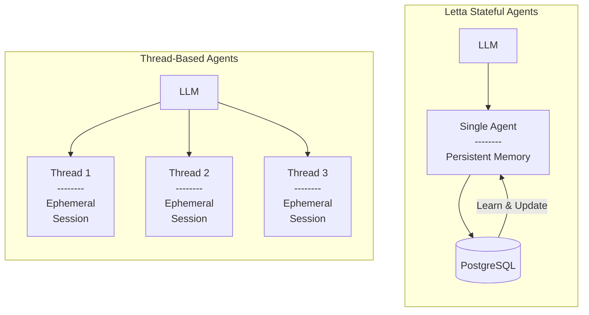

If you would like to create common starting points for new conversation "threads", we recommending using [agent templates](/guides/templates/overview) to create new agents for each conversation, or directly copying agent state from an existing agent.

For multi-users applications, we recommend creating an agent per-user, though you can also have multiple users message a single agent (but it will be a single shared message history).

## Create an agent


  To start creating agents, you can run a Letta server locally using **Letta Desktop**, deploy a server locally + remotely with **Docker**, or use **Letta Cloud**. See our [quickstart guide](/quickstart) for more information.


Assuming we're running a Letta server locally at `http://localhost:8283`, we can create a new agent via the REST API, Python SDK, or TypeScript SDK:


  ```curl curl
  curl -X POST http://localhost:8283/v1/agents/ \
       -H "Content-Type: application/json" \
       -d '{
    "memory_blocks": [
      {
        "value": "The human'\''s name is Bob the Builder.",
        "label": "human"
      },
      {
        "value": "My name is Sam, the all-knowing sentient AI.",
        "label": "persona"
      }
    ],
    "model": "openai/gpt-4o-mini",
    "context_window_limit": 16000,
    "embedding": "openai/text-embedding-3-small"
  }'
  ```

  ```python title="python" maxLines=50
  # install letta_client with `pip install letta-client`
  from letta_client import Letta

  # create a client to connect to your local Letta server
  client = Letta(
    base_url="http://localhost:8283"
  )

  # create an agent with two basic self-editing memory blocks
  agent_state = client.agents.create(
      memory_blocks=[
          {
            "label": "human",
            "value": "The human's name is Bob the Builder."
          },
          {
            "label": "persona",
            "value": "My name is Sam, the all-knowing sentient AI."
          }
      ],
      model="openai/gpt-4o-mini",
      context_window_limit=16000,
      embedding="openai/text-embedding-3-small"
  )

  # the AgentState object contains all the information about the agent
  print(agent_state)
  ```

  ```typescript maxLines=50 title="node.js"
  // install letta-client with `npm install @letta-ai/letta-client`
  import { LettaClient } from '@letta-ai/letta-client'

  // create a client to connect to your local Letta server
  const client = new LettaClient({
    baseUrl: "http://localhost:8283"
  });

  // create an agent with two basic self-editing memory blocks
  const agentState = await client.agents.create({
      memoryBlocks: [
          {
            label: "human",
            value: "The human's name is Bob the Builder."
          },
          {
            label: "persona",
            value: "My name is Sam, the all-knowing sentient AI."
          }
      ],
      model: "openai/gpt-4o-mini",
      contextWindowLimit: 16000,
      embedding: "openai/text-embedding-3-small"
  });

  // the AgentState object contains all the information about the agent
  console.log(agentState);
  ```


You can also create an agent without any code using the [Agent Development Environment (ADE)](/agent-development-environment).
All Letta agents are stored in a database on the Letta server, so you can access the same agents from the ADE, the REST API, the Python SDK, and the TypeScript SDK.

The response will include information about the agent, including its `id`:

```json
{
  "id": "agent-43f8e098-1021-4545-9395-446f788d7389",
  "name": "GracefulFirefly",
  ...
}
```

Once an agent is created, you can message it:


  ```curl curl
  curl --request POST \
    --url http://localhost:8283/v1/agents/$AGENT_ID/messages \
    --header 'Content-Type: application/json' \
    --data '{
    "messages": [
      {
        "role": "user",
        "content": "hows it going????"
      }
    ]
  }'
  ```

  ```python title="python" maxLines=50
  # send a message to the agent
  response = client.agents.messages.create(
      agent_id=agent_state.id,
      messages=[
          {
              "role": "user",
              "content": "hows it going????"
          }
      ]
  )

  # the response object contains the messages and usage statistics
  print(response)

  # if we want to print the usage stats
  print(response.usage)

  # if we want to print the messages
  for message in response.messages:
      print(message)
  ```

  ```typescript maxLines=50 title="node.js"
  // send a message to the agent
  const response = await client.agents.messages.create(
      agentState.id, {
          messages: [
              {
                  role: "user",
                  content: "hows it going????"
              }
          ]
      }
  );

  // the response object contains the messages and usage statistics
  console.log(response);

  // if we want to print the usage stats
  console.log(response.usage)

  // if we want to print the messages
  for (const message of response.messages) {
      console.log(message);
  }
  ```


### Message Types

The `response` object contains the following attributes:

* `usage`: The usage of the agent after the message was sent (the prompt tokens, completition tokens, and total tokens)
* `message`: A list of `LettaMessage` objects, generated by the agent

#### `LettaMessage`

The `LettaMessage` object is a simplified version of the `Message` object stored in the database backend.
Since a `Message` can include multiple events like a chain-of-thought and function calls, `LettaMessage` simplifies messages to have the following types:

* `reasoning_message`: The inner monologue (chain-of-thought) of the agent
* `tool_call_message`: An agent's tool (function) call
* `tool_call_return`: The result of executing an agent's tool (function) call
* `assistant_message`: An agent calling the `send_message` tool to communicate with the user
* `system_message`: A system message (for example, an alert about the user logging in)
* `user_message`: A user message

The `assistant_message` message type is a convenience wrapper around the `tool_call_message` when the tool call is the predefined `send_message` tool that makes it easier to parse agent messages.
If you prefer to see the raw tool call even in the `send_message` case, you can set `use_assistant_message` to `false` in the request `config` (see the [endpoint documentation](/api-reference/agents/messages/create)).

## Common agent operations

For more in-depth guide on the full set of Letta agent operations, check out our [API reference](/api-reference/overview), our extended [Python SDK](https://github.com/letta-ai/letta/blob/main/examples/docs/example.py) and [TypeScript SDK](https://github.com/letta-ai/letta/blob/main/examples/docs/node/example.ts) examples, as well as our other [cookbooks](/cookbooks).

If you're using a self-hosted Letta server, you should set the **base URL** (`base_url` in Python, `baseUrl` in TypeScript) to the Letta server's URL (e.g. `http://localhost:8283`) when you create your client. See an example [here](/api-reference/overview).

If you're using a self-hosted server, you can omit the token if you're not using [password protection](/guides/server/docker#password-protection-advanced).
If you are using password protection, set your **token** to the **password**.
If you're using Letta Cloud, you should set the **token** to your **Letta Cloud API key**.

### Retrieving an agent's state

The agent's state is always persisted, so you can retrieve an agent's state by its ID.


The result of the call is an `AgentState` object:


### List agents

Replace `agent_id` with your actual agent ID.


The result of the call is a list of `AgentState` objects:


### Delete an agent

To delete an agent, you can use the `DELETE` endpoint with your `agent_id`:


# Agent Architectures

> Explore all available agent architectures and compare their capabilities


  
    

      Agent architecture card

      Agent architecture card

      

        MemGPT agents
      


      

        Agents that can edit their own memory
      

    

  

  
    

      Agent architecture card

      Agent architecture card

      

        Sleep-time agents
      


      

        Memory editing via subconscious agents
      

    

  

  
    

      Agent architecture card

      Agent architecture card

      

        Low-latency (voice) agents
      


      

        Agents optimized for low-latency settings
      

    

  

  
    

      Agent architecture card

      Agent architecture card

      

        ReAct agents
      


      

        Tool-calling agents without memory
      

    

  

  
    

      Agent architecture card

      Agent architecture card

      

        Workflows
      


      

        LLMs executing sequential tool calls
      

    

  

  
    

      Agent architecture card

      Agent architecture card

      

        Stateful workflows
      


      

        Workflows that can adapt over time
      

    

  


## Comparing the architectures


  **Unsure of which architecture to use?**

  Consider starting with our default agent architecture (MemGPT), which is highly autonomous and has long-term self-editing memory.
  You can constrain the behavior to be more deterministic (ie more "workflow-like") by adding [tool rules](/guides/agents/tool-rules) to your agent.


| Architecture                                                           | Reasoning Traces | Tool Calling | Tool Rules | Persistent Messages | Long-term Memory | Usecase                                  |
| ---------------------------------------------------------------------- | ---------------- | ------------ | ---------- | ------------------- | ---------------- | ---------------------------------------- |
| [MemGPT agents](/guides/agents/architectures/memgpt)                   | ✓                | ✓            | ✓          | ✓                   | ✓                | Long-running (perpetual) stateful agents |
| [Sleep-time agents](/guides/agents/architectures/sleeptime)            | ✓                | ✓            | ✓          | ✓                   | ✓                | Async (subconscious) memory processing   |
| [Low-latency (voice) agents](/guides/agents/architectures/low-latency) | ✓                | ✓            | ✓          | ✓                   | ✓                | Stateful agents with latency constraints |
| [ReAct agents](/guides/agents/architectures/react)                     | ✓                | ✓            | ✓          | ✓                   | -                | Simple memory-less tool-calling agents   |
| [Workflows](/guides/agents/architectures/workflows)                    | ✓                | ✓            | ✓          | -                   | -                | Predefined, sequential processes         |
| [Stateful workflows](/guides/agents/architectures/stateful-workflows)  | ✓                | ✓            | ✓          | -                   | ✓                | Workflows that can adapt over time       |


# MemGPT Agents

> Based on the groundbreaking MemGPT research paper


  Letta is made by the [creators of MemGPT](https://www.letta.com/about-us), and the default agent architecture in Letta is the official/original implementation of the MemGPT agent architecture.


MemGPT agents solve the context window limitation of LLMs through context engineering across two tiers of memory: **in-context (core) memory** (including the system instructions, read-write memory blocks, and conversation history), and **out-of-context memory** (older evicted conversation history, and external memory stores).

To learn more about the origins of MemGPT, you can read the [MemGPT research paper](https://arxiv.org/abs/2310.08560), or take the free [LLM OS course](https://www.deeplearning.ai/short-courses/llms-as-operating-systems-agent-memory/?utm_campaign=memgpt-launch\&utm_content=331638345\&utm_medium=social\&utm_source=docs\&hss_channel=tw-992153930095251456) on DeepLearning.ai.

## MemGPT: the original LLM operating system

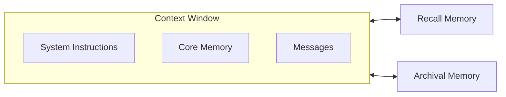

MemGPT agents are equipped with memory-editing tools that allow them to edit their in-context memory, and pull external data into the context window.

In Letta, the agent type `memgpt_agent` implements the original agent architecture from the MemGPT research paper, which includes a set of base tools:

* `send_message`: required for sending messages to the user
* `core_memory_append` and `core_memory_replace`: used for editing the contents of memory blocks in core memory (in-context memory)
* `conversation_search` for searching the conversation history ("recall storage" from the paper)
* `archival_memory_insert` and `archival_memory_search`: used for searching the archival memory (an external embedding-based memory store)

When the context window is full, the conversation history is compacted into a recursive summary (stored as a memory block).
In MemGPT all agent data is persisted indefinitely, and old message are still available via the `conversation_search` tool.

## Multi-step tool calling (heartbeats)

MemGPT agents are exclusively tool-calling agents - there is no native "chat" mode, which is why the `send_message` tool is required to send messages to the user (this makes is easy to have you agent "chat" with a user over multiple modalities, simply by adding various types of messaging tools to the agent).

MemGPT agents can execute multiple tool calls in sequence via the use of **heartbeats**: all tool calls have an additional `request_heartbeat` parameter, which when set to `true` will return execution back to the agent after the tool call returns. Additionally, if a tool call fails, a heartbeat is automatically requested to allow the agent to self-correct.

## Reasoning (thinking)

In MemGPT agents, reasoning (aka "thinking") is always exposed by the underlying LLM before the agent takes an action.
With standard models, reasoning is generated via an additional "thinking" field injected into the tool call arguments (similar to the heartbeat parameter).
For models that natively generate reasoning, MemGPT agents can be configured to use the native reasoning output of the model (note that certain model providers like OpenAI hide reasoning tokens from the developer).

## MemGPT v2: the latest iteration of MemGPT

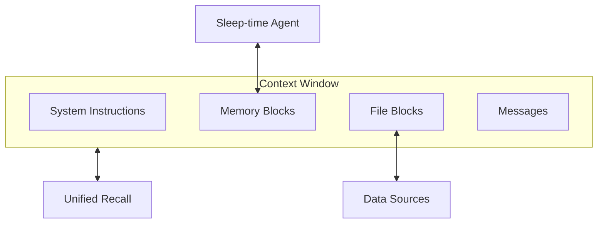

The agent type `memgpt_v2_agent` implements the latest iteration of the MemGPT agent architecture, based on our latest research in [memory management](https://www.letta.com/blog/sleep-time-compute) and [model benchmarking](https://www.letta.com/blog/letta-leaderboard). We recommend using the v2 agent for most use cases.

**Key differences in v2:**

* [Sleep-time agent](/guides/agents/architectures/sleeptime) for background memory management
* [File-based tools](/guides/agents/sources) (`open_file`, `grep_file`, `search_file`) for memory editing
* Unified `recall` tool replaces conversation and archival memory tools

## Creating MemGPT Agents


  ```python title="Python"
  from letta_client import Letta

  client = Letta(token="LETTA_API_KEY")

  agent_state = client.agents.create(
      agent_type="memgpt_v2_agent",  # or "memgpt_agent" for v1
      model="openai/gpt-4.1",
      embedding="openai/text-embedding-3-small",
      memory_blocks=[
          {
            "label": "human",
            "value": "The human's name is Chad. They like vibe coding."
          },
          {
            "label": "persona",
            "value": "My name is Sam, the all-knowing sentient AI."
          }
      ],
      tools=["web_search", "run_code"]
  )
  ```

  ```typescript title="TypeScript"
  import { LettaClient } from '@letta-ai/letta-client'

  const client = new LettaClient({ token: "LETTA_API_KEY" });

  const agentState = await client.agents.create({
      agentType: "memgpt_v2_agent",  // or "memgpt_agent" for v1
      model: "openai/gpt-4.1",
      embedding: "openai/text-embedding-3-small",
      memoryBlocks: [
          {
            label: "human",
            value: "The human's name is Chad. They like vibe coding."
          },
          {
            label: "persona",
            value: "My name is Sam, the all-knowing sentient AI."
          }
      ],
      tools: ["web_search", "run_code"]
  });
  ```

  ```bash title="cURL"
  curl -X POST https://api.letta.com/v1/agents \
       -H "Authorization: Bearer $LETTA_API_KEY" \
       -H "Content-Type: application/json" \
       -d '{
    "agent_type": "memgpt_v2_agent",
    "model": "openai/gpt-4.1",
    "embedding": "openai/text-embedding-3-small",
    "memory_blocks": [
      {
        "label": "human",
        "value": "The human'\''s name is Chad. They like vibe coding."
      },
      {
        "label": "persona",
        "value": "My name is Sam, the all-knowing sentient AI."
      }
    ],
    "tools": ["web_search", "run_code"]
  }'
  ```


# Sleep-time Agents

> Based on the new sleep-time compute research paper


  To learn more about sleep-time compute, check out our [blog](https://www.letta.com/blog/sleep-time-compute) and [research paper](https://arxiv.org/abs/2504.13171).


In Letta, you can create special **sleep-time agents** that share the memory of your primary agents, but run in the background and can modify the memory asynchronously. You can think of sleep-time agents as a special form of multi-agent architecture, where all agents in the system share one or more memory blocks. A single agent can have one or more associated sleep-time agents to process data such as the conversation history or data sources to manage the memory blocks of the primary agent.

To enable sleep-time agents for your agent, create the agent with type `sleeptime_agent`. When you create an agent of this type, this will automatically create:

* A primary agent (i.e. general-purpose agent) tools for `send_message`, `conversation_search`, and `archival_memory_search`. This is your "main" agent that you configure and interact with.
* A sleep-time agent with tools to manage the memory blocks of the primary agent. It is possible that additional, ephemeral sleep-time agents will be created when you add data into data sources of the primary agent.

## Background: Memory Blocks

Sleep-time agents specialize in generating *learned context*. Given some original context (e.g. the conversation history, a set of files) the sleep-time agent will reflect on the original context to iteratively derive a learned context. The learned context will reflect the most important pieces of information or insights from the original context.

In Letta, the learned context is saved in a memory block. A memory block represents a labeled section of the context window with an associated character limit. Memory blocks can be shared between multiple agents. A sleep-time agent will write the learned context to a memory block, which can also be shared with other agents that could benefit from those learnings.

Memory blocks can be access directly through the API to be updated, retrieved, or deleted.

```python
# get a block by label
block = client.agents.blocks.retrieve(agent_id=agent_id, block_label="persona")

# get a block by ID
block = client.blocks.retrieve(block_id=block_id)
```

When sleep-time is enabled for an agent, there will be one or more sleep-time agents created to manage the memory blocks of the primary agent. These sleep-time agents will run in the background and can modify the memory blocks of the primary agent asynchronously. One sleep-time agent (created when the primary agent is created) will generate learned context from the conversation history to update the memory blocks of the primary agent. Additional ephemeral sleep-time agents will be created when you add data into data sources of the primary agent to process the data sources in the background. These ephemeral agents will create and write to a block specific to the data source, and be deleted once they are finished processing the data sources.

## Sleep-time agent for conversation


When a `sleeptime_agent` is created, a primary agent and a sleep-time agent are created as part of a multi-agent group under the hood. The sleep-time agent is responsible for generating learned context from the conversation history to update the memory blocks of the primary agent. The group ensures that for every `N` steps taken by the primary agent, the sleep-time agent is invoked with data containing new messages in the primary agent's message history.


### Configuring the frequency of sleep-time updates

The sleep-time agent will be triggered every N-steps (default `5`) to update the memory blocks of the primary agent. You can configure the frequency of updates by setting the `sleeptime_agent_frequency` parameter when creating the agent.

```python maxLines=50
from letta_client import Letta
from letta_client.types import SleeptimeManagerUpdate

client = Letta(token="LETTA_API_KEY")

# create a sleep-time-enabled agent
agent = client.agents.create(
    memory_blocks=[
        {"value": "", "label": "human"},
        {"value": "You are a helpful assistant.", "label": "persona"},
    ],
    model="anthropic/claude-3-7-sonnet-20250219",
    embedding="openai/text-embedding-3-small",
    enable_sleeptime=True,
)
print(f"Created agent id {agent.id}")

# get the multi-agent group
group_id = agent.multi_agent_group.id
current_frequence = agent.multi_agent_group.sleeptime_agent_frequency
print(f"Group id: {group_id}, frequency: {current_frequence}")

# update the frequency to every 2 steps
group = client.groups.modify(
    group_id=group_id,
    manager_config=SleeptimeManagerUpdate(
        sleeptime_agent_frequency=2
    ),
)
```

We recommend keeping the frequency relatively high (e.g. 5 or 10) as triggering the sleep-time agent too often can be expensive (due to high token usage) and has diminishing returns.

## Sleep-time agents for data sources


Sleep-time-enabled agents will spawn additional ephemeral sleep-time agents when you add data into data sources of the primary agent to process the data sources in the background. These ephemeral agents will create and write to a block specific to the data source, and be deleted once they are finished processing the data sources.

When a file is uploaded to a data source, it is parsed into passages (chunks of text) which are embedded and saved into the main agent's archival memory. If sleeptime is enabled, the sleep-time agent will also process each passage's text to update the memory block corresponding to the data source. The sleep-time agent will create an `instructions` block that contains the data source description, to help guide the learned context generation.


  Give your data sources an informative `name` and `description` when creating them to help the sleep-time agent generate better learned context, and to help the primary agent understand what the associated memory block is for.


Below is an example of using the SDK to attach a data source to a sleep-time-enabled agent:

```python maxLines=50
from letta_client import Letta

client = Letta(token="LETTA_API_KEY")

agent = client.agents.create(
    memory_blocks=[
        {"value": "", "label": "human"},
        {"value": "You are a helpful assistant.", "label": "persona"},
    ],
    model="anthropic/claude-3-7-sonnet-20250219",
    embedding="openai/text-embedding-3-small",
    enable_sleeptime=True,
)
print(f"Created agent id {agent.id}")

# create a source
source_name = "employee_handbook"
source = client.sources.create(
    name=source_name,
    description="Provides reference information for the employee handbook",
    embedding="openai/text-embedding-3-small" # must match agent
)
# attach the source to the agent
client.agents.sources.attach(
    source_id=source.id,
    agent_id=agent.id
)

# upload a file: this will trigger processing
job = client.sources.files.upload(
    file=open("handbook.pdf", "rb"),
    source_id=source.id
)
```

This code will create and attach a memory block with the label `employee_handbook` to the agent. An ephemeral sleep-time agent will be created to process the data source and write to the memory block, and be deleted once all the passages in the data source have been processed.


  Processing each `Passage` from a data source will invoke many LLM requests by the sleep-time agent, so you should only process relatively small files (a few MB) of data.


# Low-latency Agents

> Agents optimized for low-latency environments like voice

Low-latency agents optimize for minimal response time by using a constrained context window and aggressive memory management. They're ideal for real-time applications like voice interfaces where latency matters more than context retention.

## Architecture

Low-latency agents use a **much smaller context window** than standard MemGPT agents, reducing the time-to-first-token at the cost of much more limited conversation history and memory block size. A sleep-time agent aggressively manages memory to keep only the most relevant information in context.

**Key differences from MemGPT v2:**

* Artificially constrained context window for faster response times
* More aggressive memory management with smaller memory blocks
* Optimized sleep-time agent tuned for minimal context size
* Prioritizes speed over comprehensive context retention

To learn more about how to use low-latency agents for voice applications, see our [Voice Agents guide](/guides/voice/overview).

## Creating Low-latency Agents

Use the `voice_convo_agent` agent type to create a low-latency agent.
Set `enable_sleeptime` to `true` to enable the sleep-time agent which will manage the memory state of the low-latency agent in the background.
Additionally, set `initial_message_sequence` to an empty array to start the conversation with no initial messages for a completely empty initial message buffer.


  ```python title="python"
  from letta_client import Letta

  client = Letta(token="LETTA_API_KEY")

  # create the Letta agent
  agent = client.agents.create(
      agent_type="voice_convo_agent",
      memory_blocks=[
          {"value": "Name: ?", "label": "human"},
          {"value": "You are a helpful assistant.", "label": "persona"},
      ],
      model="openai/gpt-4o-mini", # Use 4o-mini for speed
      embedding="openai/text-embedding-3-small",
      enable_sleeptime=True,
      initial_message_sequence = [],
  )
  ```

  ```typescript title="node.js"
  import { LettaClient } from '@letta-ai/letta-client'

  const client = new LettaClient({ token: "LETTA_API_KEY" });

  // create the Letta agent
  const agent = await client.agents.create({
      agentType: "voice_convo_agent",
      memoryBlocks: [
          { value: "Name: ?", label: "human" },
          { value: "You are a helpful assistant.", label: "persona" },
      ],
      model: "openai/gpt-4o-mini", // Use 4o-mini for speed
      embedding: "openai/text-embedding-3-small",
      enableSleeptime: true,
      initialMessageSequence: [],
  });
  ```

  ```bash title="curl"
  curl -X POST https://api.letta.com/v1/agents \
       -H "Authorization: Bearer $LETTA_API_KEY" \
       -H "Content-Type: application/json" \
       -d '{
    "agent_type": "voice_convo_agent",
    "memory_blocks": [
      {
        "value": "Name: ?",
        "label": "human"
      },
      {
        "value": "You are a helpful assistant.",
        "label": "persona"
      }
    ],
    "model": "openai/gpt-4o-mini",
    "embedding": "openai/text-embedding-3-small",
    "enable_sleeptime": true,
    "initial_message_sequence": []
  }'
  ```


# ReAct Agents

> Agents that reason and call tools in a loop

ReAct agents are based on the [ReAct research paper](https://arxiv.org/abs/2210.03629) and follow a "Reason then Act" pattern. In Letta, agents using the ReAct architecture can reason and call tools in a loop (using the same heartbeat mechanism from MemGPT), but lack the **long-term memory capabilities** of MemGPT agents.

## Architecture

ReAct agents maintain conversation context through summarization but cannot edit their own memory or access historical messages beyond the context window.

**Key differences from MemGPT agents:**

* No read-write memory blocks or memory editing tools
* No access to evicted conversation history
* Simple conversation summarization instead of recursive memory management
* Tool calling without persistent state beyond the current session

**When to use ReAct agents:**

* Tool-calling tasks that don't require long-term memory
* Stateless interactions where conversation summarization is sufficient

## Creating ReAct Agents

To create a ReAct agent, simply use the `react_agent` agent type when creating your agent.
There is no need to pass any memory blocks to the agent, since ReAct agents do not have any long-term memory.


  ```python title="python"
  from letta_client import Letta

  client = Letta(token="LETTA_API_KEY")

  # create the ReAct agent
  agent = client.agents.create(
      agent_type="react_agent",
      model="openai/gpt-4.1",
      embedding="openai/text-embedding-3-small",
      tools=["web_search", "run_code"]
  )
  ```

  ```typescript title="node.js"
  import { LettaClient } from '@letta-ai/letta-client'

  const client = new LettaClient({ token: "LETTA_API_KEY" });

  // create the ReAct agent
  const agent = await client.agents.create({
      agentType: "react_agent",
      model: "openai/gpt-4.1",
      embedding: "openai/text-embedding-3-small",
      tools: ["web_search", "run_code"]
  });
  ```

  ```bash title="curl"
  curl -X POST https://api.letta.com/v1/agents \
       -H "Authorization: Bearer $LETTA_API_KEY" \
       -H "Content-Type: application/json" \
       -d '{
    "agent_type": "react_agent",
    "model": "openai/gpt-4.1",
    "embedding": "openai/text-embedding-3-small",
    "tools": ["web_search", "run_code"]
  }'
  ```


# Workflows

> Workflows are systems that execute tool calls in a sequence

Workflows execute predefined sequences of tool calls with LLM-driven decision making. Use the `workflow_agent` agent type for structured, sequential processes where you need deterministic execution paths.

Workflows are stateless by default but can branch and make decisions based on tool outputs and LLM reasoning.

## Agents vs Workflows

**Agents** are autonomous systems that decide what tools to call and when, based on goals and context.

**Workflows** are predefined sequences where the LLM follows structured paths (for example, start with tool A, then call either tool B or tool C), making decisions within defined branching points.

The definition between an *agent* and a *workflow* is not always clear and each can have various overlapping levels of autonomy: workflows can be made more autonomous by structuring the decision points to be highly general, and agents can be made more deterministic by adding tool rules to constrain their behavior.

## Workflows vs Tool Rules

An alternative to workflows is using autonomous agents (MemGPT, ReAct, Sleep-time) with [tool rules](/guides/agents/tool-rules) to constrain behavior.

**Use the workflow architecture when:**

* You have an existing workflow to implement in Letta (e.g., moving from n8n, LangGraph, or another workflow builder)
* You need strict sequential execution with minimal autonomy

**Use tool rules (on top of other agent architectures) when:**

* You want more autonomous behavior, but with certain guardrails
* Your task requires adaptive decision making (tool sequences are hard to predict)
* You want to have the flexibility (as a developer) to adapt the level of autonomy (for example, reducing constraints as the underlying LLMs improve)

## Creating Workflows

Workflows are created using the `workflow_agent` agent type.
By default, there are no constraints on the sequence of tool calls that can be made: to add constraints and build a "graph", you can use the `tool_rules` parameter to add tool rules to the agent.

For example, in the following code snippet, we are creating a workflow agent that can call the `web_search` tool, and then call either the `send_email` or `create_report` tool, based on the LLM's reasoning.


  ```python title="python" maxLines=50
  from letta_client import Letta

  client = Letta(token="LETTA_API_KEY")

  # create the workflow agent with tool rules
  agent = client.agents.create(
      agent_type="workflow_agent",
      model="openai/gpt-4.1",
      embedding="openai/text-embedding-3-small",
      tools=["web_search", "send_email", "create_report"],
      tool_rules=[
          {
              "tool_name": "web_search",
              "type": "run_first"
          },
          {
              "tool_name": "web_search",
              "type": "constrain_child_tools",
              "children": ["send_email", "create_report"]
          },
          {
              "tool_name": "send_email",
              "type": "exit_loop"
          },
          {
              "tool_name": "create_report",
              "type": "exit_loop"
          }
      ]
  )
  ```

  ```typescript title="node.js" maxLines=50
  import { LettaClient } from '@letta-ai/letta-client'

  const client = new LettaClient({ token: "LETTA_API_KEY" });

  // create the workflow agent with tool rules
  const agent = await client.agents.create({
      agentType: "workflow_agent",
      model: "openai/gpt-4.1",
      embedding: "openai/text-embedding-3-small",
      tools: ["web_search", "send_email", "create_report"],
      toolRules: [
          {
              toolName: "web_search",
              type: "run_first"
          },
          {
              toolName: "web_search",
              type: "constrain_child_tools",
              children: ["send_email", "create_report"]
          },
          {
              toolName: "send_email",
              type: "exit_loop"
          },
          {
              toolName: "create_report",
              type: "exit_loop"
          }
      ]
  });
  ```

  ```bash title="curl" maxLines=50
  curl -X POST https://api.letta.com/v1/agents \
       -H "Authorization: Bearer $LETTA_API_KEY" \
       -H "Content-Type: application/json" \
       -d '{
    "agent_type": "workflow_agent",
    "model": "openai/gpt-4.1",
    "embedding": "openai/text-embedding-3-small",
    "tools": ["web_search", "send_email", "create_report"],
    "tool_rules": [
      {
        "tool_name": "web_search",
        "type": "run_first"
      },
      {
        "tool_name": "web_search",
        "type": "constrain_child_tools",
        "children": ["send_email", "create_report"]
      },
      {
        "tool_name": "send_email",
        "type": "exit_loop"
      },
      {
        "tool_name": "create_report",
        "type": "exit_loop"
      }
    ]
  }'
  ```


# Stateful Workflows

> Workflows that have memory and can self-correct between runs

In some advanced usecases, you may want your agent to have persistent memory while not retaining conversation history.
For example, if you are using a Letta agent as a "workflow" that's run many times across many different users, you may not want to keep the conversation or event history inside of the message buffer.

You can create a stateful agent that does not retain conversation (event) history (i.e. a "stateful workflow") by setting the `message_buffer_autoclear` flag to `true` during [agent creation](/api-reference/agents/create). If set to `true` (default `false`), the message history will not be persisted in-context between requests (though the agent will still have access to in-context memory blocks).

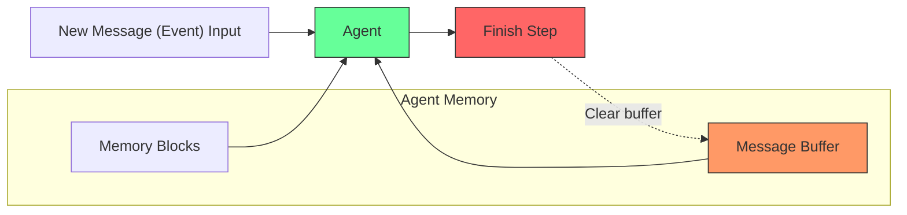


# Agent Memory

> What is agent memory, and how does it work?

Agent memory is what enables AI agents to maintain persistent state, learn from interactions, and develop long-term relationships with users. Unlike traditional chatbots that treat each conversation as isolated, agents with sophisticated memory systems can build understanding over time.

## The MemGPT Approach to Memory

Letta is built by the creators of [MemGPT](https://arxiv.org/abs/2310.08560), a research paper that introduced the concept of an "LLM Operating System" for memory management. The base agent design in Letta is a MemGPT-style agent, which means it inherits the core principles of:

* **Self-editing memory**: Agents can modify their own memory using tools
* **Memory hierarchy**: Different types of memory for different purposes
* **Context window management**: Intelligent loading and unloading of information

## Types of Memory in Letta

Letta agents have access to multiple memory systems:

### Core Memory (In-Context)

Fast, always-accessible memory that stays in the agent's context window. This includes:

* **Persona**: The agent's personality and role
* **Human**: Information about the user
* **Custom memory blocks**: Additional structured information

### External Memory (Out-of-Context)

Long-term storage for large amounts of information:

* Conversation history beyond context limits (e.g. "recall memory")
* Vector databases for semantic search (e.g. "archival memory")
* Uploaded documents and files

## Why Agent Memory Matters

Effective memory management enables:

* **Personalization**: Agents remember user preferences and history
* **Learning**: Agents improve performance through accumulated experience
* **Context preservation**: Important information persists across conversations
* **Scalability**: Handle unlimited conversation length and data volume

## Memory Management in Practice

Letta provides multiple ways to work with agent memory:

* **Automatic management**: Agents intelligently decide what to remember
* **Manual control**: Developers can directly view and modify memory blocks
* **Shared memory**: Multiple agents can access common memory blocks
* **External data sources**: Connect agents to files, databases, and APIs

Memory blocks are the fundamental units of Letta's memory system - they can be modified by the agent itself, other agents, or developers through the API.


# Memory Blocks

> Understanding the building blocks of agent memory


  Interested in learning more about the origin of memory blocks? Read our [blog post](https://www.letta.com/blog/memory-blocks).


Memory blocks represent a section of an agent's context window. An agent may have multiple memory blocks, or none at all. A memory block consists of:

* A `label`, which is a unique identifier for the block
* A `description`, which describes the purpose of the block
* A `value`, which is the contents/data of the block
* A `limit`, which is the size limit (in characters) of the block

## The importance of the `description` field

When making memory blocks, it's crucial to provide a good `description` field that accurately describes what the block should be used for.
The `description` is the main information used by the agent to determine how to read and write to that block. Without a good description, the agent may not understand how to use the block.

Because `persona` and `human` are two popular block labels, Letta autogenerates default descriptions for these blocks if you don't provide them. If you provide a description for a memory block labelled `persona` or `human`, the default description will be overridden.

For `persona`, the default is:

> The persona block: Stores details about your current persona, guiding how you behave and respond. This helps you to maintain consistency and personality in your interactions.

For `human`, the default is:

> The human block: Stores key details about the person you are conversing with, allowing for more personalized and friend-like conversation.

## Read-only blocks

Memory blocks are read-write by default (so the agent can update the block using memory tools), but can be set to read-only by setting the `read_only` field to `true`. When a block is read-only, the agent cannot update the block.

Read-only blocks are useful when you want to give an agent access to information (for example, a shared memory block about an organization), but you don't want the agent to be able to make potentially destructive changes to the block.

## Creating an agent with memory blocks

When you create an agent, you can specify memory blocks to also be created with the agent. For most chat applications, we recommend create a `human` block (to represent memories about the user) and a `persona` block (to represent the agent's persona).


  ```python title="python" maxLines=50
  # install letta_client with `pip install letta-client`
  from letta_client import Letta

  # create a client to connect to your local Letta server
  client = Letta(
    base_url="http://localhost:8283"
  )

  # create an agent with two basic self-editing memory blocks
  agent_state = client.agents.create(
      memory_blocks=[
          {
            "label": "human",
            "value": "The human's name is Bob the Builder.",
            "limit": 5000
          },
          {
            "label": "persona",
            "value": "My name is Sam, the all-knowing sentient AI.",
            "limit": 5000
          }
      ],
      model="openai/gpt-4o-mini",
      embedding="openai/text-embedding-3-small"
  )
  ```

  ```typescript maxLines=50 title="node.js"
  // install letta-client with `npm install @letta-ai/letta-client`
  import { LettaClient } from '@letta-ai/letta-client'

  // create a client to connect to your local Letta server
  const client = new LettaClient({
    baseUrl: "http://localhost:8283"
  });

  // create an agent with two basic self-editing memory blocks
  const agentState = await client.agents.create({
      memoryBlocks: [
          {
            label: "human",
            value: "The human's name is Bob the Builder.",
            limit: 5000
          },
          {
            label: "persona",
            value: "My name is Sam, the all-knowing sentient AI.",
            limit: 5000
          }
      ],
      model: "openai/gpt-4o-mini",
      embedding: "openai/text-embedding-3-small"
  });
  ```


When the agent is created, the corresponding blocks are also created and attached to the agent, so that the block value will be in the context window.

## Creating and attaching memory blocks

You can also directly create blocks and attach them to an agent. This can be useful if you want to create blocks that are shared between multiple agents. If multiple agents are attached to a block, they will all have the block data in their context windows (essentially providing shared memory).

Below is an example of creating a block directory, and attaching the block to two agents by specifying the `block_ids` field.


  ```python title="python" maxLines=50
  # create a persisted block, which can be attached to agents
  block = client.blocks.create(
      label="organization",
      description="A block to store information about the organization",
      value="Organization: Letta",
      limit=4000,
  )

  # create an agent with both a shared block and its own blocks
  shared_block_agent1 = client.agents.create(
      name="shared_block_agent1",
      memory_blocks=[
          {
              "label": "persona",
              "value": "I am agent 1"
          },
      ],
      block_ids=[block.id],
      model="openai/gpt-4o-mini",
      embedding="openai/text-embedding-3-small"
  )

  # create another agent sharing the block
  shared_block_agent2 = client.agents.create(
      name="shared_block_agent2",
      memory_blocks=[
          {
              "label": "persona",
              "value": "I am agent 2"
          },
      ],
      block_ids=[block.id],
      model="openai/gpt-4o-mini",
      embedding="openai/text-embedding-3-small"
  )
  ```

  ```typescript maxLines=50 title="node.js"
  // create a persisted block, which can be attached to agents
  const block = await client.blocks.create({
      label: "organization",
      description: "A block to store information about the organization",
      value: "Organization: Letta",
      limit: 4000,
  });

  // create an agent with both a shared block and its own blocks
  const sharedBlockAgent1 = await client.agents.create({
      name: "shared_block_agent1",
      memoryBlocks: [
          {
              label: "persona",
              value: "I am agent 1"
          },
      ],
      blockIds: [block.id],
      model: "openai/gpt-4o-mini",
      embedding: "openai/text-embedding-3-small"

  });

  // create another agent sharing the block
  const sharedBlockAgent2 = await client.agents.create({
      name: "shared_block_agent2",
      memoryBlocks: [
          {
              label: "persona",
              value: "I am agent 2"
          },
      ],
      blockIds: [block.id],
      model: "openai/gpt-4o-mini",
      embedding: "openai/text-embedding-3-small"
  });
  ```


You can also attach blocks to existing agents:

```python
client.agents.blocks.attach(agent_id=agent.id, block_id=block.id)
```

You can see all agents attached to a block by using the `block_id` field in the [blocks retrieve](/api-reference/blocks/retrieve) endpoint.


# Context Engineering

> How Letta engineerings the context window of your agents

Context engineering (aka "memory management" or "context management") is the process of managing the context window of an agent to ensure it has access to the information it needs to perform its task.

Letta and [MemGPT](https://arxiv.org/abs/2310.08560) introduced the concept of **agentic context engineering**, where the context window engineering is done by one or more AI agents. In Letta, agents are able to manage their own context window (and the context window of other agents!) using special memory management tools.

## Memory management in regular agents

By default, Letta agents are provided with tools to modify their own memory blocks. This allows agents to learn and form memories over time, as described in the MemGPT paper.

The default tools are:

* `core_memory_replace`: Replace a value inside a block
* `core_memory_append`: Append a new value to a block

If you do not want your agents to manage their memory, you should disable default tools with `include_base_tools=False` during the agent creation. You can also detach the memory editing tools post-agent creation - if you do so, remember to check the system instructions to make sure there are no references to tools that no longer exist.

### Memory management with sleep-time compute

If you want to enable memory management with sleep-time compute, you can set `enable_sleeptime=True` in the agent creation. For agents enabled with sleep-time, Letta will automatically create sleep-time agents which have the ability to update the blocks of the primary agent.

Memory management with sleep-time compute can reduce the latency of your main agent (since it is no longer responsible for managing its own memory), but can come at the cost of higher token usage. See our documentation on sleeptime agents for more details.

## Enabling agents to modify their own memory blocks with tools

You can enable agents to modify their own blocks with tools. By default, agents with type `memgpt_agent` will have the tools `core_memory_replace` and `core_memory_append` to allow them to replace or append values in their own blocks. You can also make custom modification to blocks by implementing your own custom tools that can access the agent's state by passing in the special `agent_state` parameter into your tools.

Below is an example of a tool that re-writes the entire memory block of an agent with a new string:

```python
def rethink_memory(agent_state: "AgentState", new_memory: str, target_block_label: str) -> None:
    """
    Rewrite memory block for the main agent, new_memory should contain all current information from the block that is not outdated or inconsistent, integrating any new information, resulting in a new memory block that is organized, readable, and comprehensive.

    Args:
        new_memory (str): The new memory with information integrated from the memory block. If there is no new information, then this should be the same as the content in the source block.
        target_block_label (str): The name of the block to write to.

    Returns:
        None: None is always returned as this function does not produce a response.
    """

    if agent_state.memory.get_block(target_block_label) is None:
        agent_state.memory.create_block(label=target_block_label, value=new_memory)

    agent_state.memory.update_block_value(label=target_block_label, value=new_memory)
    return None
```

## Modifying blocks via the API

You can also [modify blocks via the API](/api-reference/agents/blocks/modify) to directly edit agents' context windows and memory. This can be useful in cases where you want to extract the contents of an agents memory some place in your application (for example, a dashboard or memory viewer), or when you want to programatically modify an agents memory state (for example, allowing an end-user to directly correct or modify their agent's memory).

## Modifying blocks of other Letta agents via API tools


  Importing the Letta Python client inside a tool is a powerful way to allow agents to interact with other agents, since you can use any of the API endpoints. For example, you could create a custom tool that allows an agent to create another Letta agent.


You can allow agents to modify the blocks of other agents by creating tools that import the Letta Python SDK, then using the block update endpoint:

```python maxLines=50
def update_supervisor_block(block_label: str, new_value: str) -> None:
    """
    Update the value of a block in the supervisor agent.

    Args:
        block_label (str): The label of the block to update.
        new_value (str): The new value for the block.

    Returns:
        None: None is always returned as this function does not produce a response.
    """
    from letta_client import Letta

    client = Letta(
        base_url="http://localhost:8283"
    )

    client.agents.blocks.modify(
        agent_id=agent_id,
        block_label=block_label,
        value=new_value
    )
```


# Data Sources & Files

> Connecting agents to external data and files

Data sources allow you to easily connect your agents to external files, for example: research papers, reports, medical records, or any other data in common text formats (`.pdf`, `.txt`, `.md`, `.json`, etc.).
A data source can consist of many files, which can be uploaded via the ADE or API.

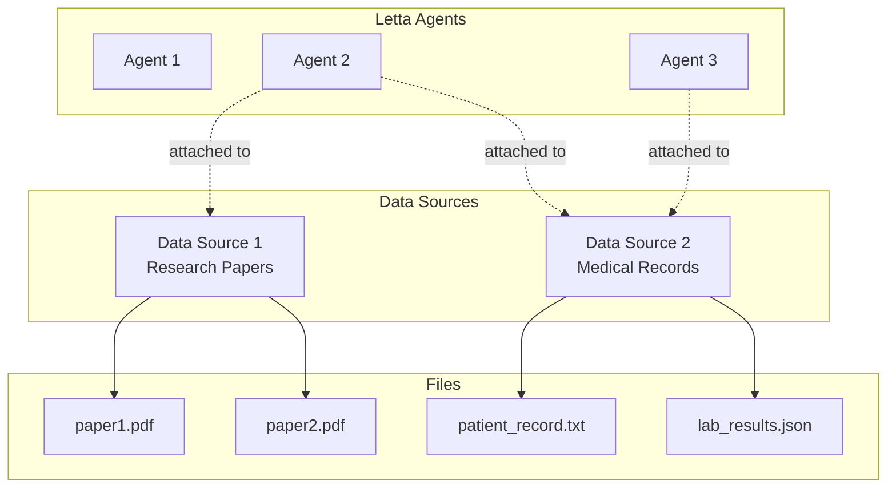

Once a file has been uploaded to a data source, the agent can access it using a set of **file tools**.
The file is automatically chunked and embedded to allow the agent to use semantic search to find relevant information in the file (in addition to standard text-based search).


  If you've used [Claude Projects](https://www.anthropic.com/news/projects) before, you can think of a **data source** in Letta as a "project", except in Letta you can connect a single agent to multiple projects (in Claude Projects, a chat session can only be associated with a single project).


## File tools

When a data source is attached to an agent, Letta automatically attaches a set of file tools to the agent:

* `open_file`: Open a file to a specific location
* `grep_file`: Search a file using a regular expression
* `search_file`: Search a file using semantic (embedding-based) search

To detach these tools from your agent, simply detach all your data sources, the file tools will be automatically removed.

## Creating a data source

### ADE

To create a data source click the "data sources" tab in the bottom-left of the ADE, then click the "create data source" button. When you create a data source inside the ADE, it will be automatically attached to your agent.

### API / SDK

To create a data source, you will need to specify a unique `name` as well as an `EmbeddingConfig`:


  ```python title="python"
  # get an available embedding_config
  embedding_configs = client.models.list_embedding_models()
  embedding_config = embedding_configs[0]

  # create the source
  source = client.sources.create(
      name="my_source",
      embedding_config=embedding_config
  )
  ```

  ```typescript title="node.js"
  // get an available embedding_config
  const embeddingConfigs = await client.models.listEmbeddingModels();
  const embeddingConfig = embeddingConfigs[0];

  // create the source
  const source = await client.sources.create({
      name: "my_source",
      embeddingConfig: embeddingConfig
  });
  ```


Now that you've created the source, you can start loading data into the source.

## Uploading a file into a data source

### ADE

Click the "data sources" tab in the bottom-left of the ADE to view your attached data sources.
To upload a file, simply drag and drop the file into the data sources tab, or click the upload (+) button.

### API / SDK

Uploading a file to a source will create an async job for processing the file, which will split the file into chunks and embed them.


  ```python title="python"
  # upload a file into the source
  job = client.sources.files.upload(
      source_id=source.id,
      file=open("my_file.txt", "rb")
  )

  # wait until the job is completed
  while True:
      job = client.jobs.retrieve(job.id)
      if job.status == "completed":
          break
      elif job.status == "failed":
          raise ValueError(f"Job failed: {job.metadata}")
      print(f"Job status: {job.status}")
      time.sleep(1)
  ```

  ```typescript title="node.js"
  // upload a file into the source
  const uploadJob = await client.sources.files.upload(
      createReadStream("my_file.txt"),
      source.id,
  );
  console.log("file uploaded")

  // wait until the job is completed
  while (true) {
      const job = await client.jobs.retrieve(uploadJob.id);
      if (job.status === "completed") {
          break;
      } else if (job.status === "failed") {
          throw new Error(`Job failed: ${job.metadata}`);
      }
      console.log(`Job status: ${job.status}`);
      await new Promise((resolve) => setTimeout(resolve, 1000));
  }
  ```


Once the job is completed, you can list the files and the generated passages in the source:


  ```python title="python"
  # list files in the source
  files = client.sources.files.list(source_id=source.id)
  print(f"Files in source: {files}")

  # list passages in the source
  passages = client.sources.passages.list(source_id=source.id)
  print(f"Passages in source: {passages}")
  ```

  ```typescript title="node.js"
  // list files in the source
  const files = await client.sources.files.list(source.id);
  console.log(`Files in source: ${files}`);

  // list passages in the source
  const passages = await client.sources.passages.list(source.id);
  console.log(`Passages in source: ${passages}`);
  ```


## Listing available data sources

You can view available data sources by listing them:


  ```python title="python"
  # list sources
  sources = client.sources.list()
  ```

  ```typescript title="node.js"
  // list sources
  const sources = await client.sources.list();
  ```


## Connecting a data source to an agent

When you attach a data source to an agent, the files inside the data source will become visible inside the agent's context window.
By default, only a limited "window" of the file will be visible to prevent context window overflow - the agent can use the file tools to browse through the files and search for information.

## Attaching the data source

### ADE

When you create a data source inside the ADE, it will be automatically attached to your agent.
You can also attach existing data sources by clicking the "attach existing" button in the data sources tab.

### API / SDK

You can attach a source to an agent by specifying both the source and agent IDs:


  ```python title="python"
  client.agents.sources.attach(agent_id=agent.id, source_id=source.id)
  ```

  ```typescript title="node.js"
  await client.agents.sources.attach(agent.id, source.id);
  ```


Note that your agent and source must be configured with the same embedding model, to ensure that the agent is able to search accross a common embedding space for archival memory.

## Detaching the data source

### ADE

To detach a data source from an agent, click the "detach" button in the data sources tab.

### API / SDK

Detaching a data source will remove the files from the agent's context window:


  ```python title="python"
  client.agents.sources.detach(agent_id=agent.id, source_id=source.id)
  ```

  ```typescript title="node.js"
  await client.agents.sources.detach(agent.id, source.id);
  ```


# Streaming agent responses

Messages from the **Letta server** can be **streamed** to the client.
If you're building a UI on the Letta API, enabling streaming allows your UI to update in real-time as the agent generates a response to an input message.

There are two kinds of streaming you can enable: **streaming agent steps** and **streaming tokens**.
To enable streaming (either mode), you need to use the [`/v1/agent/messages/stream`](/api-reference/agents/messages/stream) API route instead of the [`/v1/agent/messages`](/api-reference/agents/messages) API route.

## Streaming agent steps

When you send a message to the Letta server, the agent may run multiple steps while generating a response.
For example, an agent may run a search query, then use the results of that query to generate a response.

When you use the `/messages/stream` route, `stream_steps` is enabled by default, and the response to the `POST` request will stream back as server-sent events (read more about SSE format [here](https://developer.mozilla.org/en-US/docs/Web/API/Server-sent_events/Using_server-sent_events)):


  ```curl curl
  curl --request POST \
    --url http://localhost:8283/v1/agents/$AGENT_ID/messages/stream \
    --header 'Content-Type: application/json' \
    --data '{
    "messages": [
      {
        "role": "user",
        "text": "hows it going????"
      }
    ]
  }'
  ```

  ```python title="python" maxLines=50
  # send a message to the agent (streaming steps)
  stream = client.agents.messages.create_stream(
      agent_id=agent_state.id,
      messages=[
        {
          "role": "user",
          "text": "hows it going????"
        }
      ],
  )

  # print the chunks coming back
  for chunk in stream:
      print(chunk)
  ```

  ```typescript maxLines=50 title="node.js"
  // send a message to the agent (streaming steps)
  const stream = await client.agents.messages.create_stream(
      agentState.id, {
          messages: [
              {
                  role: "user",
                  content: "hows it going????"
              }
          ]
      }
  );

  // print the chunks coming back
  for await (const chunk of stream) {
      console.log(chunk);
  };
  ```


```json maxLines=50
data: {"id":"...","date":"...","message_type":"reasoning_message","reasoning":"User keeps asking the same question; maybe it's part of their style or humor. I\u2019ll respond warmly and play along."}

data: {"id":"...","date":"...","message_type":"assistant_message","assistant_message":"Hey! It\u2019s going well! Still here, ready to chat. How about you? Anything exciting happening?"}

data: {"message_type":"usage_statistics","completion_tokens":65,"prompt_tokens":2329,"total_tokens":2394,"step_count":1}

data: [DONE]
```

## Streaming tokens

You can also stream chunks of tokens from the agent as they are generated by the underlying LLM process by setting `stream_tokens` to `true` in your API request:


  ```curl curl
  curl --request POST \
    --url http://localhost:8283/v1/agents/$AGENT_ID/messages/stream \
    --header 'Content-Type: application/json' \
    --data '{
    "messages": [
      {
        "role": "user",
        "text": "hows it going????"
      }
    ],
    "stream_tokens": true
  }'
  ```

  ```python title="python" maxLines=50
  # send a message to the agent (streaming steps)
  stream = client.agents.messages.create_stream(
      agent_id=agent_state.id,
      messages=[
        {
          "role": "user",
          "text": "hows it going????"
        }
      ],
      stream_tokens=True,
  )

  # print the chunks coming back
  for chunk in stream:
      print(chunk)
  ```

  ```typescript maxLines=50 title="node.js"
  // send a message to the agent (streaming steps)
  const stream = await client.agents.messages.create_stream(
      agentState.id, {
          messages: [
              {
                  role: "user",
                  content: "hows it going????"
              }
          ],
          streamTokens: true
      }
  );

  // print the chunks coming back
  for await (const chunk of stream) {
      console.log(chunk);
  };
  ```


With token streaming enabled, the response will look very similar to the prior example (agent steps streaming), but instead of receiving complete messages, the client receives multiple messages with chunks of the response.
The client is responsible for reassembling the response from the chunks.
We've ommited most of the chunks for brevity:

```sh
data: {"id":"...","date":"...","message_type":"reasoning_message","reasoning":"It's"}

data: {"id":"...","date":"...","message_type":"reasoning_message","reasoning":" interesting"}

... chunks ommited

data: {"id":"...","date":"...","message_type":"reasoning_message","reasoning":"!"}

data: {"id":"...","date":"...","message_type":"assistant_message","assistant_message":"Well"}

... chunks ommited

data: {"id":"...","date":"...","message_type":"assistant_message","assistant_message":"."}

data: {"message_type":"usage_statistics","completion_tokens":50,"prompt_tokens":2771,"total_tokens":2821,"step_count":1}

data: [DONE]
```

## Tips on handling streaming in your client code

The data structure for token streaming is the same as for agent steps streaming (`LettaMessage`) - just instead of returning complete messages, the Letta server will return multiple messages each with a chunk of the response.
Because the format of the data looks the same, if you write your frontend code to handle tokens streaming, it will also work for agent steps streaming.

For example, if the Letta server is connected to multiple LLM backend providers and only a subset of them support LLM token streaming, you can use the same frontend code (interacting with the Letta API) to handle both streaming and non-streaming providers.
If you send a message to an agent with streaming enabled (`stream_tokens` are `true`), the server will stream back `LettaMessage` objects with chunks if the selected LLM provider supports token streaming, and `LettaMessage` objects with complete strings if the selected LLM provider does not support token streaming.


# JSON Mode & Structured Output

> Get structured JSON responses from your Letta agents

Letta provides two ways to get structured JSON output from agents: **Structured Generation through Tools** (recommended) and the `response_format` parameter.

## Quick Comparison


  **Recommended**: Use **Structured Generation through Tools** - works with all providers (Anthropic, OpenAI, Google, etc.) and integrates naturally with Letta's tool-calling architecture.


  **Structured Generation through Tools**:

  * ✅ Universal provider compatibility
  * ✅ Both reasoning AND structured output
  * ✅ Per-message control
  * ✅ Works even as "dummy tool" for pure formatting


  **`response_format` parameter**:

  * ⚠️ OpenAI-compatible providers only (NOT Anthropic)
  * ⚠️ Persistent agent state (affects all future responses)
  * ⚠️ Requires `send_message` tool to be attached
  * ✅ Built-in provider schema enforcement


## Structured Generation through Tools (Recommended)

Create a tool that defines your desired response format. The tool arguments become your structured data, and you can extract them from the tool call.

### Creating a Structured Generation Tool


  ```python title="python" maxLines=100
  from letta_client import Letta

  # Create client (Letta Cloud)
  client = Letta(token="LETTA_API_KEY")

  # Or for self-hosted
  # client = Letta(base_url="http://localhost:8283")

  def generate_rank(rank: int, reason: str):
      """Generate a ranking with explanation.

      Args:
          rank (int): The numerical rank from 1-10.
          reason (str): The reasoning behind the rank.
      """
      print("Rank generated")
      return

  # Create the tool
  tool = client.tools.create(func=generate_rank)

  # Create agent with the structured generation tool
  agent_state = client.agents.create(
      model="openai/gpt-4o-mini",
      embedding="openai/text-embedding-3-small",
      memory_blocks=[
          {
              "label": "human",
              "value": "The human's name is Chad. They are a food enthusiast who enjoys trying different cuisines."
          },
          {
              "label": "persona",
              "value": "I am a helpful food critic assistant. I provide detailed rankings and reviews of different foods and restaurants."
          }
      ],
      tool_ids=[tool.id]
  )
  ```

  ```typescript title="node.js" maxLines=100
  import { LettaClient } from '@letta-ai/letta-client'

  // Create client (Letta Cloud)
  const client = new LettaClient({ token: "LETTA_API_KEY" });

  // Or for self-hosted
  // const client = new LettaClient({ baseUrl: "http://localhost:8283" });

  // First create the tool
  const toolCode = `def generate_rank(rank: int, reason: str):
      """Generate a ranking with explanation.

      Args:
          rank (int): The numerical rank from 1-10.
          reason (str): The reasoning behind the rank.
      """
      print("Rank generated")
      return`;

  const tool = await client.tools.create({
      sourceCode: toolCode,
      sourceType: "python"
  });

  // Create agent with the structured generation tool
  const agentState = await client.agents.create({
      model: "openai/gpt-4o-mini",
      embedding: "openai/text-embedding-3-small",
      memoryBlocks: [
          {
              label: "human",
              value: "The human's name is Chad. They are a food enthusiast who enjoys trying different cuisines."
          },
          {
              label: "persona",
              value: "I am a helpful food critic assistant. I provide detailed rankings and reviews of different foods and restaurants."
          }
      ],
      toolIds: [tool.id]
  });
  ```


### Using the Structured Generation Tool


  ```python title="python" maxLines=100
  # Send message and instruct agent to use the tool
  response = client.agents.messages.create(
      agent_id=agent_state.id,
      messages=[
          {
              "role": "user",
              "content": "How do you rank sushi as a food? Please use the generate_rank tool to provide your response."
          }
      ]
  )

  # Extract structured data from tool call
  for message in response.messages:
      if message.message_type == "tool_call_message":
          import json
          args = json.loads(message.tool_call.arguments)
          rank = args["rank"]
          reason = args["reason"]
          print(f"Rank: {rank}")
          print(f"Reason: {reason}")

  # Example output:
  # Rank: 8
  # Reason: Sushi is a highly regarded cuisine known for its fresh ingredients...
  ```

  ```typescript title="node.js" maxLines=100
  // Send message and instruct agent to use the tool
  const response = await client.agents.messages.create(
      agentState.id, {
          messages: [
              {
                  role: "user",
                  content: "How do you rank sushi as a food? Please use the generate_rank tool to provide your response."
              }
          ]
      }
  );

  // Extract structured data from tool call
  for (const message of response.messages) {
      if (message.messageType === "tool_call_message") {
          const args = JSON.parse(message.toolCall.arguments);
          console.log(`Rank: ${args.rank}`);
          console.log(`Reason: ${args.reason}`);
      }
  }

  // Example output:
  // Rank: 8
  // Reason: Sushi is a highly regarded cuisine known for its fresh ingredients...
  ```


The agent will call the tool, and you can extract the structured arguments:

```json
{
  "rank": 8,
  "reason": "Sushi is a highly regarded cuisine known for its fresh ingredients, artistic presentation, and cultural significance."
}
```

## Using `response_format` for Provider-Native JSON Mode

The `response_format` parameter enables structured output/JSON mode from LLM providers that support it. This approach is fundamentally different from tools because **`response_format` becomes a persistent part of the agent's state** - once set, all future responses from that agent will follow the format until explicitly changed.

Under the hood, `response_format` overrides the schema for the `send_message` tool (which appears as `AssistantMessage` in the API), but it doesn't affect other tools - those continue to work normally with their original schemas.


  **Requirements for `response_format`:**

  * Only works with providers that support structured outputs (like OpenAI) - NOT Anthropic or other providers
  * The `send_message` tool must be attached to the agent (it's included by default but can be detached)


### Basic JSON Mode


  ```python title="python" maxLines=100
  from letta_client import Letta

  # Create client (Letta Cloud)
  client = Letta(token="LETTA_API_KEY")

  # Create agent with basic JSON mode (OpenAI/compatible providers only)
  agent_state = client.agents.create(
      model="openai/gpt-4o-mini",
      embedding="openai/text-embedding-3-small",
      memory_blocks=[
          {
              "label": "human",
              "value": "The human's name is Chad. They work as a data analyst and prefer clear, organized information."
          },
          {
              "label": "persona",
              "value": "I am a helpful assistant who provides clear and well-organized responses."
          }
      ],
      response_format={"type": "json_object"}
  )

  # Send message expecting JSON response
  response = client.agents.messages.create(
      agent_id=agent_state.id,
      messages=[
          {
              "role": "user",
              "content": "How do you rank sushi as a food? Please respond in JSON format with rank and reason fields."
          }
      ]
  )

  for message in response.messages:
      print(message)
  ```

  ```typescript title="node.js" maxLines=100
  import { LettaClient } from '@letta-ai/letta-client'

  // Create client (Letta Cloud)
  const client = new LettaClient({ token: "LETTA_API_KEY" });

  // Create agent with basic JSON mode (OpenAI/compatible providers only)
  const agentState = await client.agents.create({
      model: "openai/gpt-4o-mini",
      embedding: "openai/text-embedding-3-small",
      memoryBlocks: [
          {
              label: "human",
              value: "The human's name is Chad. They work as a data analyst and prefer clear, organized information."
          },
          {
              label: "persona",
              value: "I am a helpful assistant who provides clear and well-organized responses."
          }
      ],
      responseFormat: { type: "json_object" }
  });

  // Send message expecting JSON response
  const response = await client.agents.messages.create(
      agentState.id, {
          messages: [
              {
                  role: "user",
                  content: "How do you rank sushi as a food? Please respond in JSON format with rank and reason fields."
              }
          ]
      }
  );

  for (const message of response.messages) {
      console.log(message);
  }
  ```


### Advanced JSON Schema Mode

For more precise control, you can use OpenAI's `json_schema` mode with strict validation:


  ```python title="python" maxLines=100
  from letta_client import Letta

  client = Letta(token="LETTA_API_KEY")

  # Define structured schema (from OpenAI structured outputs guide)
  response_format = {
      "type": "json_schema",
      "json_schema": {
          "name": "food_ranking",
          "schema": {
              "type": "object",
              "properties": {
                  "rank": {
                      "type": "integer",
                      "minimum": 1,
                      "maximum": 10
                  },
                  "reason": {
                      "type": "string"
                  },
                  "categories": {
                      "type": "array",
                      "items": {
                          "type": "object",
                          "properties": {
                              "name": { "type": "string" },
                              "score": { "type": "integer" }
                          },
                          "required": ["name", "score"],
                          "additionalProperties": False
                      }
                  }
              },
              "required": ["rank", "reason", "categories"],
              "additionalProperties": False
          },
          "strict": True
      }
  }

  # Create agent
  agent_state = client.agents.create(
      model="openai/gpt-4o-mini",
      embedding="openai/text-embedding-3-small",
      memory_blocks=[]
  )

  # Update agent with response format
  agent_state = client.agents.update(
      agent_id=agent_state.id,
      response_format=response_format
  )

  # Send message
  response = client.agents.messages.create(
      agent_id=agent_state.id,
      messages=[
          {"role": "user", "content": "How do you rank sushi? Include categories for taste, presentation, and value."}
      ]
  )

  for message in response.messages:
      print(message)
  ```

  ```typescript title="node.js" maxLines=100
  import { LettaClient } from '@letta-ai/letta-client'

  const client = new LettaClient({ token: "LETTA_API_KEY" });

  // Define structured schema (from OpenAI structured outputs guide)
  const responseFormat = {
      type: "json_schema",
      jsonSchema: {
          name: "food_ranking",
          schema: {
              type: "object",
              properties: {
                  rank: {
                      type: "integer",
                      minimum: 1,
                      maximum: 10
                  },
                  reason: {
                      type: "string"
                  },
                  categories: {
                      type: "array",
                      items: {
                          type: "object",
                          properties: {
                              name: { type: "string" },
                              score: { type: "integer" }
                          },
                          required: ["name", "score"],
                          additionalProperties: false
                      }
                  }
              },
              required: ["rank", "reason", "categories"],
              additionalProperties: false
          },
          strict: true
      }
  };

  // Create agent
  const agentState = await client.agents.create({
      model: "openai/gpt-4o-mini",
      embedding: "openai/text-embedding-3-small",
      memoryBlocks: []
  });

  // Update agent with response format
  const updatedAgent = await client.agents.update(
      agentState.id,
      { responseFormat }
  );

  // Send message
  const response = await client.agents.messages.create(
      agentState.id, {
          messages: [
              { role: "user", content: "How do you rank sushi? Include categories for taste, presentation, and value." }
          ]
      }
  );

  for (const message of response.messages) {
      console.log(message);
  }
  ```


With structured JSON schema, the agent's response will be strictly validated:

```json
{
  "rank": 8,
  "reason": "Sushi is highly regarded for its fresh ingredients and artful presentation",
  "categories": [
    {"name": "taste", "score": 9},
    {"name": "presentation", "score": 10},
    {"name": "value", "score": 6}
  ]
}
```

## Updating Agent Response Format

You can update an existing agent's response format:


  ```python title="python" maxLines=100
  # Update agent to use JSON mode (OpenAI/compatible only)
  client.agents.update(
      agent_id=agent_state.id,
      response_format={"type": "json_object"}
  )

  # Or remove JSON mode
  client.agents.update(
      agent_id=agent_state.id,
      response_format=None
  )
  ```

  ```typescript title="node.js" maxLines=100
  // Update agent to use JSON mode (OpenAI/compatible only)
  await client.agents.update(agentState.id, {
      responseFormat: { type: "json_object" }
  });

  // Or remove JSON mode
  await client.agents.update(agentState.id, {
      responseFormat: null
  });
  ```


# Multi-modal (image inputs)

> Send images to your agents


  Multi-modal features require compatible language models. Ensure your agent is configured with a multi-modal capable model.


Letta agents support image inputs, enabling richer conversations and more powerful agent capabilities.

## Model Support

Multi-modal capabilities depend on the underlying language model.
You can check which models from the API providers support image inputs by checking their individual model pages:

* **[OpenAI](https://platform.openai.com/docs/models)**: GPT-4.1, o1/3/4, GPT-4o
* **[Anthropic](https://docs.anthropic.com/en/docs/about-claude/models/overview)**: Claude Opus 4, Claude Sonnet 4
* **[Gemini](https://ai.google.dev/gemini-api/docs/models)**: Gemini 2.5 Pro, Gemini 2.5 Flash

If the provider you're using doesn't support image inputs, your images will still appear in the context window, but as a text message telling the agent that an image exists.

## ADE Support

You can pass images to your agents by drag-and-dropping them into the chat window, or clicking the image icon to select a manual file upload.


## Usage Examples (SDK)

### Sending an Image via URL


  ```python title="python" maxLines=100
  from letta_client import Letta

  client = Letta(token="LETTA_API_KEY")

  response = client.agents.messages.create(
      agent_id=agent_state.id,
      messages=[
          {
              "role": "user",
              "content": [
                  {
                      "type": "image",
                      "source": {
                          "type": "url",
                          "url": "https://upload.wikimedia.org/wikipedia/commons/a/a7/Camponotus_flavomarginatus_ant.jpg",
                      },
                  },
                  {
                      "type": "text",
                      "text": "Describe this image."
                  }
              ],
          }
      ],
  )
  ```

  ```typescript title="node.js" maxLines=100
  import { LettaClient } from '@letta-ai/letta-client';

  const client = new LettaClient({ token: "LETTA_API_KEY" });

  const response = await client.agents.messages.create(
      agentState.id, {
          messages: [
              {
                  role: "user",
                  content: [
                      {
                          type: "image",
                          source: {
                              type: "url",
                              url: "https://upload.wikimedia.org/wikipedia/commons/a/a7/Camponotus_flavomarginatus_ant.jpg",
                          },
                      },
                      {
                          type: "text",
                          text: "Describe this image."
                      }
                  ],
              }
          ],
      }
  );
  ```


### Sending an Image via Base64


  ```python title="python" maxLines=100
  import base64
  import httpx
  from letta_client import Letta

  client = Letta(token="LETTA_API_KEY")

  image_url = "https://upload.wikimedia.org/wikipedia/commons/a/a7/Camponotus_flavomarginatus_ant.jpg"
  image_data = base64.standard_b64encode(httpx.get(image_url).content).decode("utf-8")

  response = client.agents.messages.create(
      agent_id=agent_state.id,
      messages=[
          {
              "role": "user",
              "content": [
                  {
                      "type": "image",
                      "source": {
                          "type": "base64",
                          "media_type": "image/jpeg",
                          "data": image_data,
                      },
                  },
                  {
                      "type": "text",
                      "text": "Describe this image."
                  }
              ],
          }
      ],
  )
  ```

  ```typescript title="node.js" maxLines=100
  import { LettaClient } from '@letta-ai/letta-client';

  const client = new LettaClient({ token: "LETTA_API_KEY" });

  const imageUrl = "https://upload.wikimedia.org/wikipedia/commons/a/a7/Camponotus_flavomarginatus_ant.jpg";
  const imageResponse = await fetch(imageUrl);
  const imageBuffer = await imageResponse.arrayBuffer();
  const imageData = Buffer.from(imageBuffer).toString('base64');

  const response = await client.agents.messages.create(
      agentState.id, {
          messages: [
              {
                  role: "user",
                  content: [
                      {
                          type: "image",
                          source: {
                              type: "base64",
                              media_type: "image/jpeg",
                              data: imageData,
                          },
                      },
                      {
                          type: "text",
                          text: "Describe this image."
                      }
                  ],
              }
          ],
      }
  );
  ```


# Multi-Agent Systems


  Check out a multi-agent tutorial [here](/cookbooks/multi-agent-async)!


  All agents in Letta are *stateful* - so when you build a multi-agent system in Letta, each agent can run both independently and with others via cross-agent messaging tools! The choice is yours.


Letta provides built-in tools for supporting cross-agent communication to build multi-agent systems.
To enable multi-agent collaboration, you should create agents that have access to the [built-in cross-agent communication tools](#built-in-multi-agent-tools) - either by attaching the tools in the ADE, or via the API or Python/TypeScript SDK.

Letta agents can also share state via [shared memory blocks](/guides/agents/multi-agent-shared-memory). Shared memory blocks allow agents to have shared memory (e.g. memory about an organization they are both a part of or a task they are both working on).

## Built-in Multi-Agent Tools


  We recommend only attaching one of `send_message_to_agent_and_wait_for_reply` or `send_message_to_agent_async`, but not both.
  Attaching both tools can cause the agent to become confused and use the tool less reliably.


Our built-in tools for multi-agent communication can be used to create both **synchronous** and **asynchronous** communication networks between agents on your Letta server.
However, because all agents in Letta are addressible via a REST API, you can also make your own custom tools that use the [API for messaging agents](/api-reference/agents/messages/create) to design your own version of agent-to-agent communication.

There are three built-in tools for cross-agent communication:

* `send_message_to_agent_async` for asynchronous multi-agent messaging,
* `send_message_to_agent_and_wait_for_reply` for synchronous multi-agent messaging,
* and `send_message_to_agents_matching_all_tags` for a "supervisor-worker" pattern

### Messaging another agent (async / no wait)

```python
# The function signature for the async multi-agent messaging tool
def send_message_to_agent_async(
    message: str,
    other_agent_id: str,
): -> str
```

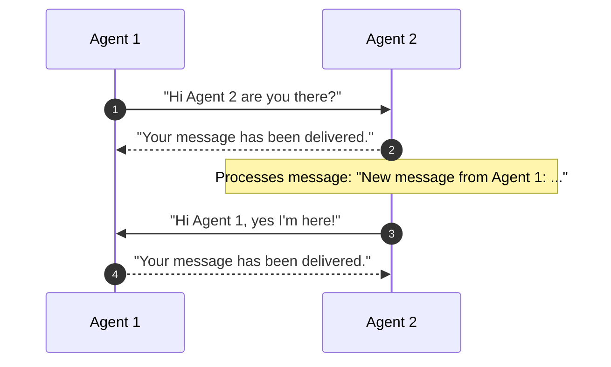

The `send_message_to_agent_async` tool allows one agent to send a message to another agent.
This tool is **asynchronous**: instead of waiting for a response from the target agent, the agent will return immediately after sending the message.
The message that is sent to the target agent contains a "message receipt", indicating which agent sent the message, which allows the target agent to reply to the sender (assuming they also have access to the `send_message_to_agent_async` tool).

### Messaging another agent (wait for reply)

```python
# The function signature for the synchronous multi-agent messaging tool
def send_message_to_agent_and_wait_for_reply(
    message: str,
    other_agent_id: str,
): -> str
```

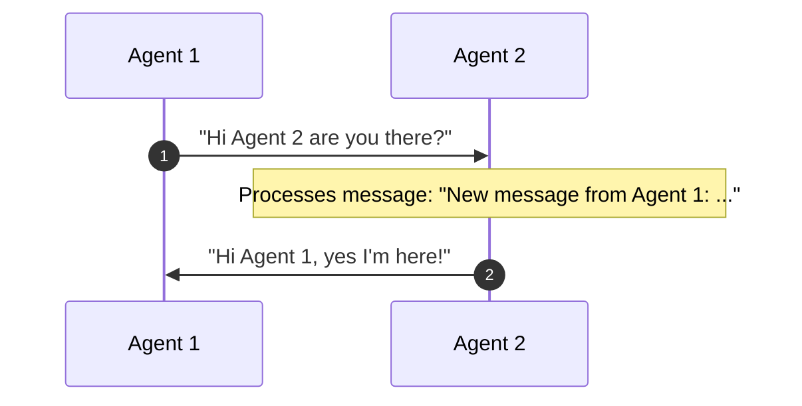

The `send_message_to_agent_and_wait_for_reply` tool also allows one agent to send a message to another agent.
However, this tool is **synchronous**: the agent will wait for a response from the target agent before returning.
The response of the target agent is returned in the tool output - if the target agent does not respond, the tool will return default message indicating no response was received.

### Messaging a group of agents (supervisor-worker pattern)

```python
# The function signature for the group broadcast multi-agent messaging tool
def send_message_to_agents_matching_all_tags(
    message: str,
    tags: List[str],
) -> List[str]:
```

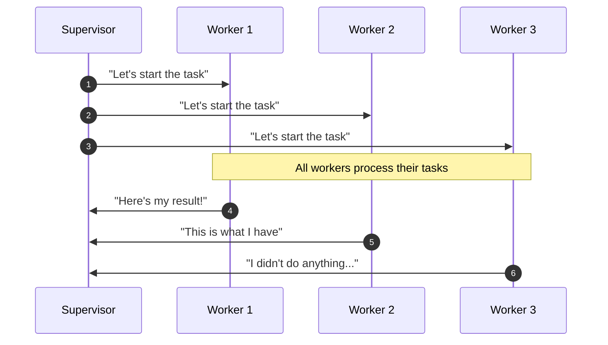

The `send_message_to_agents_matching_all_tags` tool allows one agent to send a message a larger group of agents in a "supervisor-worker" pattern.
For example, a supervisor agent can use this tool to send a message asking all workers in a group to begin a task.
This tool is also **synchronous**, so the result of the tool call will be a list of the responses from each agent in the group.


# Building Custom Multi-Agent Tools


  We recommend using the [pre-made multi-agent messaging tools](/guides/agents/multi-agent) for most use cases, but advanced users can write custom tools to support complex communication patterns.


You can also write your own agent communication tools by using the Letta API and writing a custom tool in Python.
Since Letta runs as a service, you can make request to the server from a custom tool to send messages to other agents via API calls.

Here's a simple example of a tool that sends a message to a specific agent:

```python title="python"
def custom_send_message_to_agent(target_agent_id: str, message_contents: str):
    """
    Send a message to a specific Letta agent.

    Args:
        target_agent_id (str): The identifier of the target Letta agent.
        message_contents (str): The message to be sent to the target Letta agent.
    """
    from letta_client import Letta

    # TODO: point this to the server where the worker agents are running
    client = Letta(base_url="http://127.0.0.1:8283")

    # message all worker agents async
    response = client.agents.send_message_async(
        agent_id=target_agent_id,
        message=message_contents,
    )
```

Below is an example of a tool that triggers agents tagged with `worker` to start their tasks:

```python title="python"
def trigger_worker_agents():
    """
    Trigger worker agents to start their tasks, without waiting for a response.
    """
    from letta_client import Letta

    # TODO: point this to the server where the worker agents are running
    client = Letta(base_url="http://127.0.0.1:8283")

    # message all worker agents async
    for agent in client.agents.list(tags=["worker"]):
        response = client.agents.send_message_async(
            agent_id=agent.id,
            message="Start my task",
        )
```


# Multi-Agent Shared Memory

Agents can share state via shared memory blocks.
This allows agents to have a "shared memory".
You can shared blocks between agents by attaching the same block ID to multiple agents.

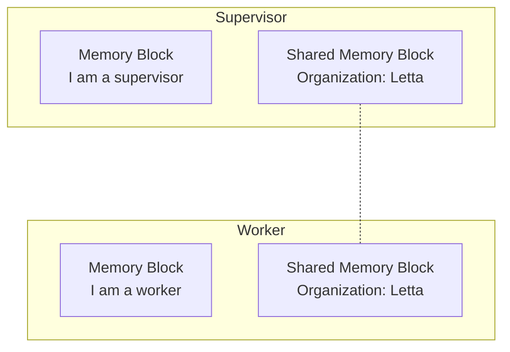

In the example code below, we create a shared memory block and attach it to a supervisor agent and a worker agent.
Because the memory block is shared, when one agent writes to it, the other agent can read the updates immediately.

```python title="python" maxLines=50
from letta_client import Letta

client = Letta(base_url="http://127.0.0.1:8283")

# create a shared memory block
shared_block = client.blocks.create(label="organization", value="Organization: Letta")

# create a supervisor agent
supervisor_agent = client.agents.create(
    model="anthropic/claude-3-5-sonnet-20241022",
    embedding="openai/text-embedding-3-small",
    # blocks created for this agentj
    memory_blocks=[{"label": "persona", "value": "I am a supervisor"}],
    # pre-existing shared block that is "attached" to this agent
    block_ids=[shared_block.id],
)

# create a worker agent
worker_agent = client.agents.create(
    model="anthropic/claude-3-5-sonnet-20241022",
    embedding="openai/text-embedding-3-small",
    # blocks created for this agent
    memory_blocks=[{"label": "persona", "value": "I am a worker"}],
    # pre-existing shared block that is "attached" to this agent
    block_ids=[shared_block.id],
)

```

Memory blocks can also be accessed by other agents, even if not shared.
For example, worker agents can write the output of their task to a memory block, which is then read by a supervisor agent.
To access the memory blocks of other agents, you can simply use the SDK clients or API to access specific agent's memory blocks (using the [core memory routes](/api-reference/agents/core-memory)).


# User Identities

You may be building a multi-user application with Letta, in which each user is associated with a specific agent.
In this scenario, you can use **Identities** to associate each agent with a user in your application.

## Using Identities

Let's assume that you have an application with multiple users that you're building on a [self-hosted Letta server](/guides/server/docker) or [Letta Cloud](/guides/cloud).
Each user has a unique username, starting at `user_1`, and incrementing up as you add more users to the platform.

To associate agents you create in Letta with your users, you can first create an **Identity** object with the user's unique ID as the `identifier_key` for your user, and then specify the **Identity** object ID when creating an agent.

For example, with `user_1`, we would create a new Identity object with `identifier_key="user_1"` and then pass `identity.id` into our [create agent request](/api-reference/agents/create):


  ```curl title="curl"
  curl -X POST https://app.letta.com/v1/identities/ \
       -H "Authorization: Bearer " \
       -H "Content-Type: application/json" \
       -d '{
    "identifier_key": "user_1",
    "name": "Caren",
    "identity_type": "user"
  }'
  {"id":"identity-634d3994-5d6c-46e9-b56b-56e34fe34ca0","identifier_key":"user_1","name":"Caren","identity_type":"user","project_id":null,"agent_ids":[],"organization_id":"org-00000000-0000-4000-8000-000000000000","properties":[]}
  curl -X POST https://app.letta.com/v1/agents/ \
       -H "Authorization: Bearer " \
       -H "Content-Type: application/json" \
       -d '{
    "memory_blocks": [],
    "llm": "anthropic/claude-3-5-sonnet-20241022",
    "context_window_limit": 200000,
    "embedding": "openai/text-embedding-3-small",
    "identity_ids": ["identity-634d3994-5d6c-46e9-b56b-56e34fe34ca0"]
  }'
  ```

  ```python title="python"
  # assumes that you already instantiated a client
  identity = client.identities.create(
      identifier_key="user_1",
      name="Caren",
      identity_type="user"
  )
  agent = client.agents.create(
      memory_blocks=[],
      model="anthropic/claude-3-5-sonnet-20241022",
      context_window_limit=200000,
      embedding="openai/text-embedding-3-small",
      identity_ids=[identity.id]
  )
  ```

  ```typescript title="node.js"
  // assumes that you already instantiated a client
  const identity = await client.identities.create({
      identifierKey: "user_1",
      name: "Caren",
      identityType: "user"
  })
  const agent = await client.agents.create({
      memoryBlocks: [],
      model: "anthropic/claude-3-5-sonnet-20241022",
      contextWindowLimit: 200000,
      embedding: "openai/text-embedding-3-small",
      identityIds: [identity.id]
  });
  ```


Then, if I wanted to search for agents associated with a specific user (e.g. called `user_id`), I could use the `identifier_keys` parameter in the [list agents request](/api-reference/agents/list):


  ```curl title="curl"
  curl -X GET "https://app.letta.com/v1/agents/?identifier_keys=user_1" \
    -H "Accept: application/json"
  ```

  ```python title="python"
  # assumes that you already instantiated a client
  user_agents = client.agents.list(
      identifier_keys=["user_1"]
  )
  ```

  ```typescript title="node.js"
  // assumes that you already instantiated a client
  await client.agents.list({
      identifierKeys: ["user_1"]
  });
  ```


You can also create an identity object and attach it to an existing agent. This can be useful if you want to enable multiple users to interact with a single agent:


  ```curl title="curl"
  curl -X POST https://app.letta.com/v1/identities/ \
       -H "Authorization: Bearer " \
       -H "Content-Type: application/json" \
       -d '{
    "identifier_key": "user_1",
    "name": "Sarah",
    "identity_type": "user"
    "agent_ids": ["agent-00000000-0000-4000-8000-000000000000"]
  }'
  ```

  ```python title="python"
  # assumes that you already instantiated a client
  identity = client.identities.create({
      identifier_key="user_1",
      name="Sarah",
      identity_type="user"
      agent_ids=["agent-00000000-0000-4000-8000-000000000000"]
  })
  ```

  ```typescript title="node.js"
  // assumes that you already instantiated a client
  const identity = await client.identities.create({
      identifierKey: "user_1",
      name: "Sarah",
      identityType: "user"
      agentIds: ["agent-00000000-0000-4000-8000-000000000000"]
  })
  ```


### Using Agent Tags to Identify Users

It's also possible to utilize our agent tags feature to associate agents with specific users. To associate agents you create in Letta with your users, you can specify a tag when creating an agent, and set the tag to the user’s unique ID.
This example assumes that you have a self-hosted Letta server running on localhost (for example, by running [`docker run ...`](/guides/server/docker)).


  ```python title="python"
  from letta_client import Letta

  # in this example we'll connect to a self-hosted Letta server
  client = Letta(base_url="http://localhost:8283")
  user_id = "my_uuid"

  # create an agent with the user_id tag
  agent = client.agents.create(
      memory_blocks=[],
      model="anthropic/claude-3-5-sonnet-20241022",
      context_window_limit=200000,
      embedding="openai/text-embedding-3-small",
      tags=[user_id]
  )
  print(f"Created agent with id {agent.id}, tags {agent.tags}")

  # list agents
  user_agents = client.agents.list(tags=[user_id])
  agent_ids = [agent.id for agent in user_agents]
  print(f"Found matching agents {agent_ids}")
  ```


## Creating and Viewing Tags in the ADE

You can also modify tags in the ADE.
Simply click the **Advanced Settings** tab in the top-left of the ADE to view an agent's tags.
You can create new tags by typing the tag name in the input field and hitting enter.


# Agent File (.af)

> Import and export agents in Letta


  For a complete list of example agents, additional documentation, and to contribute to the Agent File standard, visit the [Agent File repository on GitHub](https://github.com/letta-ai/agent-file).


Agent File (`.af`) is an open standard file format for serializing stateful agents. It provides a portable way to share agents with persistent memory and behavior across different environments.

You can import and export agents to and from any Letta server (including both self-hosted servers and Letta Cloud) using the `.af` file format.


  
    Agent File logo
  


## What is Agent File?

Agent Files package all components of a stateful agent:

* System prompts
* Editable memory (personality and user information)
* Tool configurations (code and schemas)
* LLM settings

By standardizing these elements in a single format, Agent File enables seamless transfer between compatible frameworks, while allowing for easy checkpointing and version control of agent state.

## Why Use Agent File?

The AI ecosystem is experiencing rapid growth in agent development, with each framework implementing its own storage mechanisms. Agent File addresses the need for a standard that enables:

* **Portability**: Move agents between systems or deploy them to new environments
* **Collaboration**: Share your agents with other developers and the community
* **Preservation**: Archive agent configurations to preserve your work
* **Versioning**: Track changes to agents over time through a standardized format

## What State Does `.af` Include?

A `.af` file contains all the state required to re-create the exact same agent:

| Component             | Description                                                                                            |
| --------------------- | ------------------------------------------------------------------------------------------------------ |
| Model configuration   | Context window limit, model name, embedding model name                                                 |
| Message history       | Complete chat history with `in_context` field indicating if a message is in the current context window |
| System prompt         | Initial instructions that define the agent's behavior                                                  |
| Memory blocks         | In-context memory segments for personality, user info, etc.                                            |
| Tool rules            | Definitions of how tools should be sequenced or constrained                                            |
| Environment variables | Configuration values for tool execution                                                                |
| Tools                 | Complete tool definitions including source code and JSON schema                                        |

## Using Agent File with Letta

### Importing Agents

You can import `.af` files using the Agent Development Environment (ADE), REST APIs, or developer SDKs.

#### Using ADE

Upload downloaded `.af` files directly through the ADE interface to easily re-create your agent.


  Importing Agent File Demo


  ```typescript title="node.js" maxLines=50
  // Install SDK with `npm install @letta-ai/letta-client`
  import { LettaClient } from '@letta-ai/letta-client'
  import { readFileSync } from 'fs';
  import { Blob } from 'buffer';

  // Assuming a Letta server is running at http://localhost:8283
  const client = new LettaClient({ baseUrl: "http://localhost:8283" });

  // Import your .af file from any location
  const file = new Blob([readFileSync('/path/to/agent/file.af')])
  const agentState = await client.agents.importAgentSerialized(file, {})

  console.log(`Imported agent: ${agentState.id}`);
  ```

  ```python title="python" maxLines=50
  # Install SDK with `pip install letta-client`
  from letta_client import Letta

  # Assuming a Letta server is running at http://localhost:8283
  client = Letta(base_url="http://localhost:8283")

  # Import your .af file from any location
  agent_state = client.agents.import_agent_serialized(file=open("/path/to/agent/file.af", "rb"))

  print(f"Imported agent: {agent.id}")
  ```

  ```curl curl
  # Assuming a Letta server is running at http://localhost:8283
  curl -X POST "http://localhost:8283/v1/agents/import" -F "file=/path/to/agent/file.af"
  ```


### Exporting Agents

You can export your own `.af` files to share by selecting "Export Agent" in the ADE.


  Exporting Agent File Demo


  ```typescript title="node.js" maxLines=50
  // Install SDK with `npm install @letta-ai/letta-client`
  import { LettaClient } from '@letta-ai/letta-client'

  // Assuming a Letta server is running at http://localhost:8283
  const client = new LettaClient({ baseUrl: "http://localhost:8283" });

  // Export your agent into a serialized schema object (which you can write to a file)
  const schema = await client.agents.exportAgentSerialized("");
  ```

  ```python title="python" maxLines=50
  # Install SDK with `pip install letta-client`
  from letta_client import Letta

  # Assuming a Letta server is running at http://localhost:8283
  client = Letta(base_url="http://localhost:8283")

  # Export your agent into a serialized schema object (which you can write to a file)
  schema = client.agents.export_agent_serialized(agent_id="")
  ```

  ```curl curl
  # Assuming a Letta server is running at http://localhost:8283
  curl -X GET http://localhost:8283/v1/agents/{AGENT_ID}/export
  ```


## FAQ

### Does `.af` work with frameworks other than Letta?

Theoretically, other frameworks could also load in `.af` files if they convert the state into their own representations. Some concepts, such as context window "blocks" which can be edited or shared between agents, are not implemented in other frameworks, so may need to be adapted per-framework.

### How does `.af` handle secrets?

Agents have associated secrets for tool execution in Letta. When you export agents with secrets, the secrets are set to `null` for security reasons.

## Contributing to Agent File

The Agent File format is a community-driven standard that welcomes contributions:

* **Share Example Agents**: Contribute your own `.af` files to the community
* **Join the Discussion**: Connect with other agent developers in our [Discord server](https://discord.gg/letta)
* **Provide Feedback**: Offer suggestions and feature requests to help refine the format

For more information on Agent File, including example agents and the complete schema specification, visit the [Agent File repository](https://github.com/letta-ai/agent-file).


# Low Latency Voice Agents

All Letta agents can be connected to a voice provider by using the voice chat completion endpoint at `http://localhost:8283/v1/voice-beta/`. However for voice applications, we recommend using the `voice_convo_agent` agent architecture, which is a low-latency architecture optimized for voice.

## Creating a latency-optimized voice agent

You can create a latency-optimized voice agent by using the `voice_convo_agent` agent architecture and setting `enable_sleeptime` to `True`.

```python
from letta_client import Letta

client = Letta(token=os.getenv('LETTA_API_KEY'))

# create the Letta agent
agent = client.agents.create(
    agent_type="voice_convo_agent",
    memory_blocks=[
        {"value": "Name: ?", "label": "human"},
        {"value": "You are a helpful assistant.", "label": "persona"},
    ],
    model="openai/gpt-4o-mini", # Use 4o-mini for speed
    embedding="openai/text-embedding-3-small",
    enable_sleeptime=True,
    initial_message_sequence = [],
)
```

This will create a low-latency agent which has a sleep-time agent to manage memory and re-write it's context in the background. You can attach additional tools and blocks to this agent just as you would any other Letta agent.

## Configuring message buffer size

You can configure the message buffer size of the agent, which controls how many messages can be kept in the buffer until they are evicted. For latency-sensitive applications, we recommend setting a low buffer size.

You can configure:

* `max_message_buffer_length`: the maximum number of messages in the buffer until a compaction (summarization) is triggered
* `min_message_buffer_length`: the minimum number of messages to keep in the buffer (to ensure continuity of the conversation)

You can configure these parameters in the ADE or from the SDK:

```python
from letta_client import VoiceSleeptimeManagerUpdate

# get the group
group_id = agent.multi_agent_group.id
max_message_buffer_length = agent.multi_agent_group.max_message_buffer_length
min_message_buffer_length = agent.multi_agent_group.min_message_buffer_length
print(f"Group id: {group_id}, max_message_buffer_length: {max_message_buffer_length},  min_message_buffer_length: {min_message_buffer_length}")
# change it to be more frequent
group = client.groups.modify(
    group_id=group_id,
    manager_config=VoiceSleeptimeManagerUpdate(
        max_message_buffer_length=10,
        min_message_buffer_length=6,
    )
)
```

## Configuring the sleep-time agent

Voice agents have a sleep-time agent that manages memory and rewrites context in the background. The sleeptime agent can have a different model type than the main agent. We recommend using bigger models for the sleeptime agent to optimize the context and memory quality, and smaller models for the main voice agent to minimize latency.

For example, you can configure the sleeptime agent to use `claude-sonnet-4` by getting the agent's ID from the group:

```python
sleeptime_agent_id = [agent_id for agent_id in group.agent_ids if agent_id != agent.id][0]
client.agents.modify(
    agent_id=sleeptime_agent_id,
    model="anthropic/claude-sonnet-4-20250514"
)
```


# Connecting with Livekit Agents

You can build an end-to-end stateful voice agent using Letta and Livekit. You can see a full example in the [letta-voice](https://github.com/letta-ai/letta-voice) repository.

For this example, you will need accounts with the following providers:

* [Livekit](https://livekit.io/) for handling the voice connection
* [Deepgram](https://deepgram.com/) for speech-to-text
* [Cartesia](https://cartesia.io/) for text-to-speech

You will also need to set up the following environment variables (or create a `.env` file):

```sh
LETTA_API_KEY=... # Letta Cloud API key (if using cloud)

LIVEKIT_URL=wss://.livekit.cloud # Livekit URL
LIVEKIT_API_KEY=... # Livekit API key
LIVEKIT_API_SECRET=... # Livekit API secret

DEEPGRAM_API_KEY=... # Deepgram API key
CARTESIA_API_KEY=... # Cartesia API key
```

## Connecting to Letta Cloud

To connect to LiveKit, you can use the Letta connector `openai.LLM.with_letta` and pass in the `agent_id` of your voice agent.

Below is an example defining an entrypoint for a Livekit agent with Letta:

```python
import os
from dotenv import load_dotenv
from livekit import agents
from livekit.agents import AgentSession, Agent, AutoSubscribe
from livekit.plugins import (
    openai,
    cartesia,
    deepgram,
)
load_dotenv()

async def entrypoint(ctx: agents.JobContext):
    agent_id = os.environ.get('LETTA_AGENT_ID')
    print(f"Agent id: {agent_id}")
    session = AgentSession(
        llm=openai.LLM.with_letta(
            agent_id=agent_id,
        ),
        stt=deepgram.STT(),
        tts=cartesia.TTS(),
    )

    await session.start(
        room=ctx.room,
        agent=Agent(instructions=""), # instructions should be set in the Letta agent
    )

    session.say("Hi, what's your name?")
    await ctx.connect(auto_subscribe=AutoSubscribe.AUDIO_ONLY)
```

You can see the full script [here](https://github.com/letta-ai/letta-voice/blob/main/main.py).

## Connecting to a self-hosted Letta server

You can also connect to a self-hosted server by specifying a `base_url`. To use LiveKit, your Letta sever needs to run with HTTPs. The easiest way to do this is by connecting ngrok to your Letta server.

### Setting up `ngrok`

If you are self-hosting the Letta server locally (at `localhost`), you will need to use `ngrok` to expose your Letta server to the internet:

1. Create an account on [ngrok](https://ngrok.com/)
2. Create an auth token and add it into your CLI

```
ngrok config add-authtoken  
```

3. Point your ngrok server to your Letta server:

```
ngrok http http://localhost:8283
```

Now, you should have a forwarding URL like `https://.ngrok.app`.

### Connecting LiveKit to a self-hosted Letta server

To connect a LiveKit agent to a self-hosted Letta server, you can use the same code as above, but with the `base_url` parameter set to the forwarding URL you got from ngrok (or whatever HTTPS URL the Letta server is running on).

```python
import os
from dotenv import load_dotenv
from livekit import agents
from livekit.agents import AgentSession, Agent, AutoSubscribe
from livekit.plugins import (
    openai,
    cartesia,
    deepgram,
)
load_dotenv()

async def entrypoint(ctx: agents.JobContext):
    agent_id = os.environ.get('LETTA_AGENT_ID')
    print(f"Agent id: {agent_id}")
    session = AgentSession(
        llm=openai.LLM.with_letta(
            agent_id=agent_id,
            base_url="https://.ngrok.app", # point to your Letta server
        ),
        stt=deepgram.STT(),
        tts=cartesia.TTS(),
    )

    await session.start(
        room=ctx.room,
        agent=Agent(instructions=""), # instructions should be set in the Letta agent
    )

    session.say("Hi, what's your name?")
    await ctx.connect(auto_subscribe=AutoSubscribe.AUDIO_ONLY)
```

You can see the full script [here](https://github.com/letta-ai/letta-voice/blob/main/main.py).
\`


# Connecting with Vapi

## Connecting to Letta Cloud


  
    Add Letta Cloud as an integration by entering your `LETTA_API_KEY` into the "Custom LLM" field at [https://dashboard.vapi.ai/settings/integrations](https://dashboard.vapi.ai/settings/integrations).

    
  

  
    Create a Vapi assistant at [https://dashboard.vapi.ai/assistants/](https://dashboard.vapi.ai/assistants/) and use the "Blank Template".

    
  

  
    Select "Custom LLM" for the model, and enter in the voice endpoint for your agent: [https://api.letta.com/v1/voice-beta/\{AGENT-ID}](https://api.letta.com/v1/voice-beta/\{AGENT-ID})

    

    
      The "Model" field will be ignored (since your 

      `agent_id`

       is already configured with a model in Letta), so can be any value. 
    
  

  
    You can now interact with your agent through Vapi, including calling and texting your agent!
  


## Connecting to a self-hosted Letta server

To connect to a self-hosted server, you will need to have a internal accessible endpoint for your Letta server and add any authentication tokens (if they exist) instead of `LETTA_API_KEY`. We recommend using ngrok to expose your Letta server to the internet.


  
    If you are self-hosting the Letta server locally (at `localhost`), you will need to use `ngrok` to expose your Letta server to the internet:

    1. Create an account on [ngrok](https://ngrok.com/)
    2. Create an auth token and add it into your CLI

    ```
    ngrok config add-authtoken  
    ```

    3. Point your ngrok server to your Letta server:

    ```
    ngrok http http://localhost:8283
    ```

    Now, you should have a forwarding URL like `https://{YOUR_FORWARDING_URL}.ngrok.app`.
  

  
    Create a Vapi assistant at [https://dashboard.vapi.ai/assistants/](https://dashboard.vapi.ai/assistants/) and use the "Blank Template".

    
  

  
    Select "Custom LLM" for the model, and enter in the voice endpoint for your agent: `https://{YOUR_FORWARDING_URL}.ngrok.app/v1/voice-beta/{AGENT_ID}`

    
      The "Model" field will be ignored (since your 

      `agent_id`

       is already configured with a model in Letta), so can be any value. 
    
  

  
    You can now interact with your agent through Vapi, including calling and texting your agent!
  


# Connecting Agents to Tools

> Understand the different ways to use tools in Letta

Tools allow agents to take actions that affect the real world.
Letta agents can use tools to manage their own memory, send messages to users, search the web, and more.

You can add custom tools to Letta by defining your own tools, and also customize the execution environment of the tools.
You can import external tool libraries by connecting your Letta agents to MCP (Model Context Protocol) servers. MCP servers are a way to expose APIs to Letta agents.

## Where to get tools for your agents

There are three main ways to connect tools to your agents:

* [**Pre-built tools**](/guides/agents/prebuilt-tools): connect to tools that are built into the Letta server, such as memory management tools and web search / code execution.
* [**Custom tools**](/guides/agents/custom-tools): define your own tools in Letta using the SDK and the ADE.
* [**MCP servers**](/guides/mcp/overview): connect your agent to tools that run on external MCP servers.

Once a tool has been created (if it's a custom tool) or connected (if it's a pre-built tool or MCP server), you can add it to an agent by passing the tool name to the `tools` parameter in the agent creation:

```python title="python" {9}
# create a new agent
agent = client.agents.create(
    memory_blocks=[
        {"label": "human", "limit": 2000, "value": "Name: Bob"},
        {"label": "persona", "limit": 2000, "value": "You are a friendly agent"}
    ],
    model="openai/gpt-4o-mini",
    embedding="openai/text-embedding-3-small",
    tools=["my_custom_tool_name"]
)
```

## Tool Execution

You can customize the environment that your tool runs in (the Python package dependencies and environment variables) by setting a tool execution environment. See more [here](/guides/agents/tool-variables).

## Tool Environment Variables

You can set agent-scoped environment variables for your tools.
These environment variables will be accessible in the sandboxed environment that any of the agent tools are run in.

For example, if you define a custom tool that requires an API key to run (e.g. `EXAMPLE_TOOL_API_KEY`), you can set the variable at time of agent creation by using the `tool_exec_environment_variables` parameter:

```python title="python" {9-11}
# create an agent with no tools
agent = client.agents.create(
    memory_blocks=[
        {"label": "human", "limit": 2000, "value": "Name: Bob"},
        {"label": "persona", "limit": 2000, "value": "You are a friendly agent"}
    ],
    model="openai/gpt-4o-mini",
    embedding="openai/text-embedding-3-small",
    tool_exec_environment_variables={
        "EXAMPLE_TOOL_API_KEY": "banana"
    }
)
```

## Tool Rules

Tool rules allow you to define graph-like constrains on your tools, such as requiring that a tool terminate agent execution or be followed by another tool.

Read more about tool rules [here](/guides/agents/tool-rules).

## External Tool Libraries

Letta supports connecting to external tool libraries via [MCP](/guides/mcp/overview).
You can connect to MCP servers via the Letta SDK (Python and TypeScript/Node.js) as well as via simple point-and-click in the ADE.


# Pre-built Tools

> Understanding the pre-built tools in the Letta server

Letta provides a set of pre-built tools that are available to all agents. These tools include memory management tools (for reading and writing to memory blocks), file editing tools, multi-agent tools, and general utility tools like web search and code execution.

## Default Memory Tools

By default, agents in Letta are created with a set of default tools including `send_message` (which generates a message to send to the user), core memory tools (allowing the agent to edit its memory blocks), and external memory tools (to read/write from archival memory, and to access recall memory, aka the conversation history):

| Tool                     | Description                                       |
| ------------------------ | ------------------------------------------------- |
| `send_message`           | Sends a message to the human user.                |
| `core_memory_append`     | Append to the contents of a block in core memory. |
| `core_memory_replace`    | Replace the contents of a block in core memory.   |
| `conversation_search`    | Search prior conversation history (recall memory) |
| `archival_memory_insert` | Add a memory to archival memory                   |
| `archival_memory_search` | Search archival memory via embedding search       |

You can disable the default tools by setting `include_base_tools` to `false` during agent creation. Note that disabling the `send_message` tool may cause agent messages (intended for the user) to appear as "reasoning" messages in the API and ADE.

## Multi-Agent Tools

Letta also includes a set of pre-made tools designed for multi-agent interaction.
See [our guide on multi-agent](/guides/agents/multi-agent) for more information.

## Web Search

The `web_search` tool allows agents to search the web for information.


  On [Letta Cloud](/guides/cloud/overview), this tool works out of the box, but when using this tool on a self-hosted Letta server, you must set a `TAVILY_API_KEY` environment variable either in during server startup or in your agent's [tool execution environment](/guides/agents/tool-variables).


## Code Interpreter

The `run_code` tool allows agents to run code (in a sandbox), for example to do data analysis or calculations. Supports Python, Javascript, Typescript, R, and Java.


  On [Letta Cloud](/guides/cloud/overview), this tool works out of the box, but when using this tool on a self-hosted Letta server, you must set a `E2B_API_KEY` environment variable either in during server startup or in your agent's [tool execution environment](/guides/agents/tool-variables).


# Define and customize tools

You can create custom tools in Letta using the Python SDK, as well as via the [ADE tool builder](/guides/ade/tools).

For your agent to call a tool, Letta constructs an OpenAI tool schema (contained in `json_schema` field) from the function you define. Letta can either parse this automatically from a properly formatting docstring, or you can pass in the schema explicitly by providing a Pydantic object that defines the argument schema.

## Creating a custom tool

### Specifying tools via Pydantic models

To create a custom tool, you can extend the `BaseTool` class and specify the following:

* `name` - The name of the tool
* `args_schema` - A Pydantic model that defines the arguments for the tool
* `description` - A description of the tool
* `tags` - (Optional) A list of tags for the tool to query
  You must also define a `run(..)` method for the tool code that takes in the fields from the `args_schema`.

Below is an example of how to create a tool by extending `BaseTool`:

```python title="python" maxLines=50
from letta_client import Letta
from letta_client.client import BaseTool
from pydantic import BaseModel
from typing import List, Type

class InventoryItem(BaseModel):
    sku: str  # Unique product identifier
    name: str  # Product name
    price: float  # Current price
    category: str  # Product category (e.g., "Electronics", "Clothing")

class InventoryEntry(BaseModel):
    timestamp: int  # Unix timestamp of the transaction
    item: InventoryItem  # The product being updated
    transaction_id: str  # Unique identifier for this inventory update

class InventoryEntryData(BaseModel):
    data: InventoryEntry
    quantity_change: int  # Change in quantity (positive for additions, negative for removals)


class ManageInventoryTool(BaseTool):
    name: str = "manage_inventory"
    args_schema: Type[BaseModel] = InventoryEntryData
    description: str = "Update inventory catalogue with a new data entry"
    tags: List[str] = ["inventory", "shop"]

    def run(self, data: InventoryEntry, quantity_change: int) -> bool:
        print(f"Updated inventory for {data.item.name} with a quantity change of {quantity_change}")
        return True

# create a client to connect to your local Letta server
client = Letta(
  base_url="http://localhost:8283"
)
# create the tool
tool_from_class = client.tools.add(
    tool=ManageInventoryTool(),
)
```

### Specifying tools via function docstrings

You can create a tool by passing in a function with a properly formatting docstring specifying the arguments and description of the tool:

```python title="python" maxLines=50
# install letta_client with `pip install letta-client`
from letta_client import Letta

# create a client to connect to your local Letta server
client = Letta(
  base_url="http://localhost:8283"
)

# define a function with a docstring
def roll_dice() -> str:
    """
    Simulate the roll of a 20-sided die (d20).

    This function generates a random integer between 1 and 20, inclusive,
    which represents the outcome of a single roll of a d20.

    Returns:
        str: The result of the die roll.
    """
    import random

    dice_role_outcome = random.randint(1, 20)
    output_string = f"You rolled a {dice_role_outcome}"
    return output_string

# create the tool
tool = client.tools.create_from_function(
    func=roll_dice
)
```

The tool creation will return a `Tool` object. You can update the tool with `client.tools.upsert_from_function(...)`.

### Specifying arguments via Pydantic models

To specify the arguments for a complex tool, you can use the `args_schema` parameter.

```python title="python" maxLines=50
# install letta_client with `pip install letta-client`
from letta_client import Letta

class Step(BaseModel):
    name: str = Field(
        ...,
        description="Name of the step.",
    )
    description: str = Field(
        ...,
        description="An exhaustic description of what this step is trying to achieve and accomplish.",
    )


class StepsList(BaseModel):
    steps: list[Step] = Field(
        ...,
        description="List of steps to add to the task plan.",
    )
    explanation: str = Field(
        ...,
        description="Explanation for the list of steps.",
    )

def create_task_plan(steps, explanation):
    """ Creates a task plan for the current task. """
    return steps


tool = client.tools.upsert_from_function(
    func=create_task_plan,
    args_schema=StepsList
)
```

Note: this path for updating tools is currently only supported in Python.

### Creating a tool from a file

You can also define a tool from a file that contains source code. For example, you may have the following file:

```python title="custom_tool.py" maxLines=50
from typing import List, Optional
from pydantic import BaseModel, Field


class Order(BaseModel):
    order_number: int = Field(
        ...,
        description="The order number to check on.",
    )
    customer_name: str = Field(
        ...,
        description="The customer name to check on.",
    )

def check_order_status(
    orders: List[Order]
):
    """
    Check status of a provided list of orders

    Args:
        orders (List[Order]): List of orders to check

    Returns:
        str: The status of the order (e.g. cancelled, refunded, processed, processing, shipping).
    """
    # TODO: implement
    return "ok"

```

Then, you can define the tool in Letta via the `source_code` parameter:

```python title="python" maxLines=50
tool = client.tools.create(
    source_code = open("custom_tool.py", "r").read()
)
```

# (Advanced) Accessing Agent State


  Tools that use `agent_state` currently do not work in the ADE live tool tester (they will error when you press "Run"), however if the tool is correct it will work once you attach it to an agent.


If you need to directly access the state of an agent inside a tool, you can use the reserved `agent_state` keyword argument, for example:

```python title="python"
def get_agent_id(agent_state: "AgentState") -> str:
    """
    A custom tool that returns the agent ID

    Returns:
        str: The agent ID
    """
    return agent_state.id
```


# Creating Tool Rules

Tool rules allows developer to define constrains on their tools, such as requiring that a tool terminate agent execution or be followed by another tool.


  ```mermaid
  flowchart LR
      subgraph init["InitToolRule"]
          direction LR
          start((Start)) --> init_tool["must_run_first"]
          init_tool --> other1["...other tools..."]
      end

      subgraph terminal["TerminalToolRule"]
          direction LR
          other2["...other tools..."] --> term_tool["terminal_tool"] --> stop1((Stop))
      end

      subgraph sequence["ChildToolRule (children)"]
          direction LR
          parent_tool["parent_tool"] --> child1["child_tool_1"]
          parent_tool --> child2["child_tool_2"]
          parent_tool --> child3["child_tool_3"]
      end

      classDef stop fill:#ffcdd2,stroke:#333
      classDef start fill:#c8e6c9,stroke:#333
      class stop1 stop
      class start start
  ```


Letta currently supports the following tool rules (with more being added):

* `TerminalToolRule(tool_name=...)`
  * If the tool is called, the agent ends execution
* `InitToolRule(tool_name=...)`
  * The tool must be called first when an agent is run
* `ChildToolRule(tool_name=..., children=[...])`
  * If the tool is called, it must be followed by one of the tools specified in `children`
* `ParentToolRule(tool_name=..., children=[...])`
  * The tool must be called before the tools specified in `children` can be called
* `ConditionalToolRule(tool_name=..., child_output_mapping={...})`
  * If the tool is called, it must be followed by one of the tools specified in `children` based off the tool's output
* `ContinueToolRule(tool_name=...)`
  * If the tool is called, the agent must continue execution
* `MaxCountPerStepToolRule(tool_name=..., max_count_limit=...)`
  * The tool cannot be called more than `max_count_limit` times in a single step

## Default tool rules

By default, the `send_message` tool is marked with `TerminalToolRule`, since you usually do not want the agent to continue executing after it has sent a message to the user.

Depending on your chosen [agent architecture](/guides/agents/architectures), there may be other default tool rules applied to improve the performance of your agent.

## Tool rule examples

For example, you can ensure that the agent will stop execution if either the `send_message` or `roll_d20` tool is called by specifying tool rules in the agent creation:

```python title="python" {6-11}
# create a new agent
agent_state = client.create_agent(
    # create the agent with an additional tool
    tools=[tool.name],
    # add tool rules that terminate execution after specific tools
    tool_rules=[
        # exit after roll_d20 is called
        TerminalToolRule(tool_name=tool.name, type="exit_loop"),
        # exit after send_message is called (default behavior)
        TerminalToolRule(tool_name="send_message", type="exit_loop"),
    ],
)

print(f"Created agent with name {agent_state.name} with tools {agent_state.tools}")
```

You can see a full working example of tool rules [here](https://github.com/letta-ai/letta/blob/0.5.2/examples/tool_rule_usage.py).


# Using Tool Variables

You can use **tool variables** to specify environment variables available to your custom tools.
For example, if you set a tool variable `PASSWORD` to `banana`, then write a custom function that prints `os.getenv('PASSWORD')` in the tool, the function will print `banana`.

## Assigning tool variables in the ADE

To assign tool variables in the Agent Development Environment (ADE), simply click on **Variables** to open the **Tool Variables** viewer:


## Assigning tool variables in the API / SDK

You can also assign tool variables on agent creation in the API with the `tool_exec_environment_variables` parameter:


  ```curl title="curl" {7-9}
  curl -X POST http://localhost:8283/v1/agents/ \
       -H "Content-Type: application/json" \
       -d '{
    "memory_blocks": [],
    "llm":"openai/gpt-4o-mini",
    "embedding":"openai/text-embedding-3-small",
    "tool_exec_environment_variables": {
        "COMPOSIO_ENTITY": "banana"
    }
  }'
  ```

  ```python title="python" {5-7}
  agent_state = client.agents.create(
      memory_blocks=[],
      model="openai/gpt-4o-mini",
      embedding="openai/text-embedding-3-small",
      tool_exec_environment_variables={
          "COMPOSIO_ENTITY": "banana"
      }
  )
  ```

  ```typescript title="node.js" {5-7}
  const agentState = await client.agents.create({
      memoryBlocks: [],
      model: "openai/gpt-4o-mini",
      embedding: "openai/text-embedding-3-small",
      toolExecEnvironmentVariables: {
          "COMPOSIO_ENTITY": "banana"
      }
  });
  ```


# What is Model Context Protocol (MCP)?

> What is MCP, and how can it be combined with agents?

[Model Context Protocol (MCP)](https://modelcontextprotocol.io) is an open protocol that enables seamless integration between LLM applications and external data sources and tools.
In Letta, you can create your own [custom tools](/guides/agents/custom-tools) that run in the Letta tool sandbox, or use MCP to connect to tools that run on external servers.

**Already familiar with MCP?** Jump to the [setup guide](/guides/mcp/setup).

## Architecture

MCP uses a **host-client-server** model. Letta acts as the **host**, creating **clients** that connect to external **servers**. Each server exposes tools, resources, or prompts through the standardized MCP protocol.

Letta's MCP integration connects your agents to external tools and data sources without requiring custom integrations.

## Integration Flow

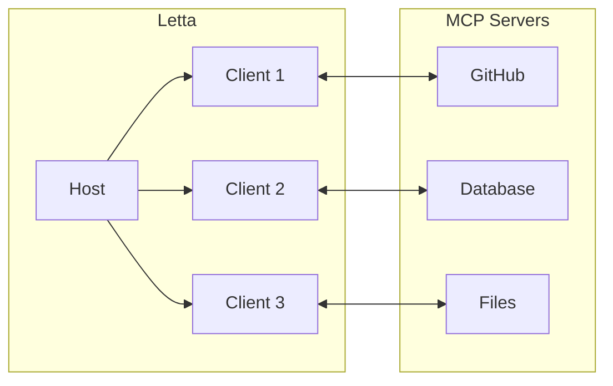

Letta creates isolated clients for each MCP server, maintaining security boundaries while providing agents access to specialized capabilities.

## Connection Methods

* **ADE**: Point-and-click server management through Letta's web interface
* **API/SDK**: Programmatic integration for production deployments


  **Letta Cloud**: Streamable HTTP and SSE only

  **Self-hosted**: All transports (stdio, HTTP, SSE)


## Benefits


  Make sure your trust the MCP server you're using.
  Never connect your agent to an MCP server that you don't trust.


MCP servers are a great way to connect your agents to rich tool libraries.
Without MCP, if you want to create a new tool to your agent (e.g., give your agent the ability to search the web), you would need to write a custom tool in Python that calls an external web search API.
Letta lets you build arbitrarily complex tools, which can be very powerful, but it also requires you to write your own tool code - with MCP, you can use pre-made tools by picking pre-made MCP servers and connecting them to Letta.

## Next Steps

Ready to connect? See the [setup guide](/guides/mcp/setup).


# Connecting Letta to MCP Servers

> Connect Letta agents to tools over Model Context Protocol (MCP)


  Letta no longer supports legacy `.json` configuration files. Use the ADE or API/SDK.


Letta supports three MCP transport types depending on your deployment and use case.

## Connection Methods

* **ADE**: Point-and-click server management via web interface
* **API/SDK**: Programmatic integration for production

## Transport Types

* **Streamable HTTP** (Recommended): Production-ready with auth support. Works on Cloud + self-hosted.
* **SSE** (Legacy): Deprecated but supported for compatibility.
* **stdio** (Self-hosted only): Local development and testing.

| Transport       | Cloud | Self-hosted |
| --------------- | ----- | ----------- |
| Streamable HTTP | ✅     | ✅           |
| SSE             | ✅     | ✅           |
| stdio           | ❌     | ✅           |

## Tool Execution Flow

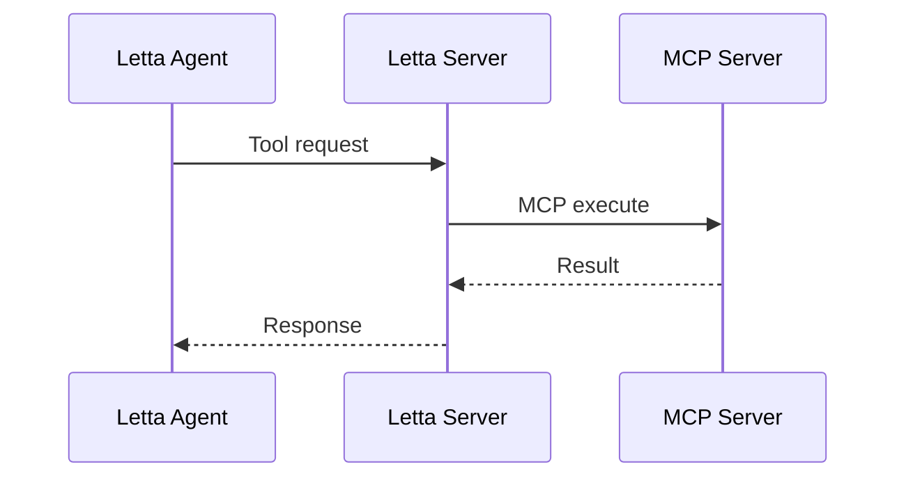

## Quick Start

1. Choose transport type based on your deployment
2. Connect via ADE: Tool Manager → Add MCP Server
3. Attach tools to agents

See [remote servers](/guides/mcp/remote) or [local servers](/guides/mcp/local) for detailed setup.


# Connecting Letta to Remote MCP Servers

> Using Streamable HTTP and SSE transports

Remote MCP servers work with both Letta Cloud and self-hosted deployments. Streamable HTTP is recommended for new integrations; SSE is deprecated but supported for legacy compatibility.

## Streamable HTTP

Recommended transport with Bearer token auth support.

**ADE**: Tool Manager → Add MCP Server → Streamable HTTP


  ```python title="python" maxLines=50
  from letta_client import Letta
  from letta_client.types import StreamableHTTPServerConfig

  client = Letta(token="LETTA_API_KEY")

  # Connect a Streamable HTTP server
  streamable_config = StreamableHTTPServerConfig(
      server_name="my-server",
      server_url="https://mcp-server.example.com/mcp",
      auth_token="your-token",  # Optional: Authorization: Bearer your-token
      custom_headers={"X-API-Version": "v1"}  # Optional: additional headers
  )
  client.tools.add_mcp_server(request=streamable_config)
  ```

  ```typescript title="node.js" maxLines=50
  import { LettaClient } from '@letta-ai/letta-client'

  const client = new LettaClient({ token: "LETTA_API_KEY" });

  // Connect a Streamable HTTP server
  const streamableConfig = {
      server_name: "my-server",
      server_url: "https://mcp-server.example.com/mcp",
      auth_token: "your-token",  // Optional: Authorization: Bearer your-token
      custom_headers: {"X-API-Version": "v1"}  // Optional: additional headers
  };

  await client.tools.addMcpServer(streamableConfig);
  ```


## SSE (Deprecated)


  SSE is deprecated. Use Streamable HTTP for new integrations.


For legacy MCP servers that only support SSE.

**ADE**: Tool Manager → Add MCP Server → SSE


  ```python title="python" maxLines=50
  from letta_client import Letta
  from letta_client.types import SseServerConfig

  client = Letta(token="LETTA_API_KEY")

  # Connect a SSE server (legacy)
  sse_config = SseServerConfig(
      server_name="legacy-server",
      server_url="https://legacy-mcp.example.com/sse",
      auth_token="optional-token"  # Optional: Authorization: Bearer optional-token
  )
  client.tools.add_mcp_server(request=sse_config)
  ```

  ```typescript title="node.js" maxLines=50
  import { LettaClient } from '@letta-ai/letta-client'

  const client = new LettaClient({ token: "LETTA_API_KEY" });

  // Connect an SSE server (legacy)
  const sseConfig = {
      server_name: "legacy-server",
      server_url: "https://legacy-mcp.example.com/sse",
      auth_token: "optional-token"  // Optional: Authorization: Bearer optional-token
  };

  await client.tools.addMcpServer(sseConfig);
  ```


## Using Tools

**ADE**: Agent → Tools → Select MCP tools


  ```python title="python" maxLines=50
  from letta_client import Letta

  client = Letta(token="LETTA_API_KEY")

  # List tools from an MCP server
  tools = client.tools.list_mcp_tools_by_server(mcp_server_name="weather-server")

  # Add a specific tool from the MCP server
  tool = client.tools.add_mcp_tool(
      mcp_server_name="weather-server",
      mcp_tool_name="get_weather"
  )

  # Create agent with MCP tool
  agent_state = client.agents.create(
      model="openai/gpt-4o-mini",
      embedding="openai/text-embedding-3-small",
      tool_ids=[tool.id]
  )

  # Use the agent with MCP tools
  response = client.agents.messages.create(
      agent_id=agent_state.id,
      messages=[
          {
              "role": "user",
              "content": "Use the weather tool to check the forecast"
          }
      ]
  )
  ```

  ```typescript title="node.js" maxLines=50
  import { LettaClient } from '@letta-ai/letta-client'

  const client = new LettaClient({ token: "LETTA_API_KEY" });

  // List tools from an MCP server
  const tools = await client.tools.listMcpToolsByServer("weather-server");

  // Add a specific tool from the MCP server
  const tool = await client.tools.addMcpTool("weather-server", "get_weather");

  // Create agent with MCP tool
  const agentState = await client.agents.create({
      model: "openai/gpt-4o-mini",
      embedding: "openai/text-embedding-3-small",
      toolIds: [tool.id]
  });

  // Use the agent with MCP tools
  const response = await client.agents.messages.create(agentState.id, {
      messages: [
          {
              role: "user",
              content: "Use the weather tool to check the forecast"
          }
      ]
  });
  ```


# Connecting Letta to Local MCP Servers

> Using stdio transport for local development


  stdio is self-hosted only. Letta Cloud does not support stdio.


stdio transport launches MCP servers as local subprocesses, ideal for development and testing.
Local (stdio) MCP servers can be useful for local development, testing, and situations where the MCP server you want to use is only available via stdio.

## Setup

**ADE**: Tool Manager → Add MCP Server → stdio → specify command and args


  ```python title="python" maxLines=50
  from letta_client import Letta
  from letta_client.types import StdioServerConfig

  # Self-hosted only
  client = Letta(base_url="http://localhost:8283")

  # Connect a stdio server (npx example - works in Docker!)
  stdio_config = StdioServerConfig(
      server_name="github-server",
      command="npx",
      args=["-y", "@modelcontextprotocol/server-github"],
      env={"GITHUB_PERSONAL_ACCESS_TOKEN": "your-token"}
  )
  client.tools.add_mcp_server(request=stdio_config)

  # List available tools
  tools = client.tools.list_mcp_tools_by_server(
      mcp_server_name="github-server"
  )

  # Add a tool to use with agents
  tool = client.tools.add_mcp_tool(
      mcp_server_name="github-server",
      mcp_tool_name="create_repository"
  )
  ```

  ```typescript title="node.js" maxLines=50
  import { LettaClient } from '@letta-ai/letta-client'

  // Self-hosted only
  const client = new LettaClient({
      baseUrl: "http://localhost:8283"
  });

  // Connect a stdio server (npx example - works in Docker!)
  const stdioConfig = {
      server_name: "github-server",
      command: "npx",
      args: ["-y", "@modelcontextprotocol/server-github"],
      env: {"GITHUB_PERSONAL_ACCESS_TOKEN": "your-token"}
  };

  await client.tools.addMcpServer(stdioConfig);

  // List available tools
  const tools = await client.tools.listMcpToolsByServer("github-server");

  // Add a tool to use with agents
  const tool = await client.tools.addMcpTool("github-server", "create_repository");
  ```


## Docker Support

Letta's Docker image includes `npx`, so npm-based MCP servers work out of the box. Custom Python scripts or missing dependencies require workarounds.

* **Works in Docker**: `npx` servers from the [official MCP repository](https://github.com/modelcontextprotocol/servers)
* **Challenging**: Custom scripts, local file paths, missing system dependencies
* **Alternatives**: Use [remote servers](/guides/mcp/sse) or [mcp-proxy](https://github.com/sparfenyuk/mcp-proxy)

## Troubleshooting

* **Server won't start**: Check command path, dependencies, environment variables
* **Connection fails**: Review Letta logs, test command manually
* **Tools missing**: Verify MCP protocol implementation and tool registration


# Key concepts

> Learn about the key ideas behind Letta

## MemGPT

**[Letta](https://letta.com)** was created by the same team that created **[MemGPT](https://research.memgpt.ai)**.

**MemGPT a *research paper*** that introduced the idea of self-editing memory in LLMs as well as other "LLM OS" concepts.
To understand the key ideas behind the MemGPT paper, see our [MemGPT concepts guide](/letta_memgpt).

MemGPT also refers to a particular **agent architecture** popularized by the research paper and open source, where the agent has a particular set of memory tools that make the agent particularly useful for long-range chat applications and document search.

**Letta is a *framework*** that allows you to build complex agents (such as MemGPT agents, or even more complex agent architectures) and run them as **services** behind REST APIs.

The **Letta Cloud platform** allows you easily build and scale agent deployments to power production applications.
The **Letta ADE** (Agent Developer Environment) is an application for agent developers that makes it easy to design and debug complex agents.

## Agents ("LLM agents")

Agents are LLM processes which can:

1. Have internal **state** (i.e. memory)

2. Can take **actions** to modify their state

3. Run **autonomously**

Agents have existed as a concept in [reinforcement learning](https://en.wikipedia.org/wiki/Reinforcement_learning) for a long time (as well as in other fields, such as [economics](https://en.wikipedia.org/wiki/Agent_\(economics\))). In Letta, LLM tool calling is used to both allow agents to run autonomously (by having the LLM determine whether to continue executing) as well as to edit state (by leveraging LLM tool calling.)
Letta uses a database (DB) backend to manage the internal state of the agent, represented in the `AgentState` object.

## Self-editing memory

The MemGPT paper introduced the idea of implementing self-editing memory in LLMs. The basic idea is to use LLM tools to allow an agent to both edit its own context window ("core memory"), as well as edit external storage (i.e. "archival memory").

## LLM OS ("operating systems for LLMs")

The LLM OS is the code that manages the inputs and outputs to the LLM and manages the program state.
We refer to this code as the "stateful layer" or "memory layer".
It includes the "agent runtime", which manages the execution of functions requested by the agent, as well as the "agentic loop" which enables multi-step reasoning.

## Persistence ("statefulness")

In Letta, all state is *persisted* by default. This means that each time the LLM is run, the state of the agent such as its memories, message history, and tools are all persisted to a DB backend.

Because all state is persisted, you can always re-load agents, tools, sources, etc. at a later point in time.
You can also load the same agent accross multiple machines or services, as long as they can can connect to the same DB backend.

## Agent microservices ("agents-as-a-service")

Letta follows the model of treating agents as individual services. That is, you interact with agents through a REST API:

```
POST /agents/{agent_id}/messages
```

Since agents are designed to be services, they can be *deployed* and connected to external applications.

For example, you want to create a personalizated chatbot, you can create an agent per-user, where each agent has its own custom memory about the individual user.

## Stateful vs stateless APIs

`ChatCompletions` is the standard for interacting with LLMs as a service. Since it is a stateless API (no notion of sessions or identify accross requests, and no state management on the server-side), client-side applications must manage things like agent memory, user personalization, and message history, and translate this state back into the `ChatCompletions` API format. Letta's APIs are designed to be *stateful*, so that this state management is done on the server, not the client.


# MemGPT

> Learn about the key ideas behind MemGPT


  The MemGPT open source framework / package was renamed to 

  *Letta*

  . You can read about the difference between Letta and MemGPT 

  [here](/concepts/letta)

  , or read more about the change on our 

  [blog post](https://www.letta.com/blog/memgpt-and-letta)

  .


## MemGPT - the research paper


  


**MemGPT** is the name of a [**research paper**](https://arxiv.org/abs/2310.08560) that popularized several of the key concepts behind the "LLM Operating System (OS)":

1. **Memory management**: In MemGPT, an LLM OS moves data in and out of the context window of the LLM to manage its memory.
2. **Memory hierarchy**: The "LLM OS" divides the LLM's memory (aka its "virtual context", similar to "[virtual memory](https://en.wikipedia.org/wiki/Virtual_memory)" in computer systems) into two parts: the in-context memory, and out-of-context memory.
3. **Self-editing memory via tool calling**: In MemGPT, the "OS" that manages memory is itself an LLM. The LLM moves data in and out of the context window using designated memory-editing tools.
4. **Multi-step reasoning using heartbeats**: MemGPT supports multi-step reasoning (allowing the agent to take multiple steps in sequence) via the concept of "heartbeats". Whenever the LLM outputs a tool call, it has to option to request a heartbeat by setting the keyword argument `request_heartbeat` to `true`. If the LLM requests a heartbeat, the LLM OS continues execution in a loop, allowing the LLM to "think" again.

You can read more about the MemGPT memory hierarchy and memory management system in our [memory concepts guide](/advanced/memory_management).

## MemGPT - the agent architecture

**MemGPT** also refers to a particular **agent architecture** that was popularized by the paper and adopted widely by other LLM chatbots:

1. **Chat-focused core memory**: The core memory of a MemGPT agent is split into two parts - the agent's own persona, and the user information. Because the MemGPT agent has self-editing memory, it can update its own personality over time, as well as update the user information as it learns new facts about the user.
2. **Vector database archival memory**: By default, the archival memory connected to a MemGPT agent is backed by a vector database, such as [Chroma](https://www.trychroma.com/) or [pgvector](https://github.com/pgvector/pgvector). Because in MemGPT all connections to memory are driven by tools, it's simple to exchange archival memory to be powered by a more traditional database (you can even make archival memory a flatfile if you want!).

## Creating MemGPT agents in the Letta framework

Because **Letta** was created out of the original MemGPT open source project, it's extremely easy to make MemGPT agents inside of Letta (the default Letta agent architecture is a MemGPT agent).
See our [agents overview](/agents/overview) for a tutorial on how to create MemGPT agents with Letta.

**The Letta framework also allow you to make agent architectures beyond MemGPT** that differ significantly from the architecture proposed in the research paper - for example, agents with multiple logical threads (e.g. a "concious" and a "subconcious"), or agents with more advanced memory types (e.g. task memory).

Additionally, **the Letta framework also allows you to expose your agents as *services*** (over REST APIs) - so you can use the Letta framework to power your AI applications.


# Troubleshooting Letta Desktop

> Resolving issues with [Letta Desktop](/install)


  Letta Desktop is currently in beta.

  For additional support please visit our [Discord server](https://discord.gg/letta) and post in the support channel.


## Known issues on Windows

### Javascript error on startup

The following error may occur on startup:

```
A Javascript error occurred in the main process
Uncaught Exception:
Error: EBUSY: resource busy or locked, copyfile
...
```

If you encounter this error, please try restarting your application.
If the error persists, please report the issue in our [support channel on Discord](https://discord.gg/letta).


# Troubleshooting the web ADE

> Resolving issues with the [web ADE](https://app.letta.com)


  For additional support please visit our [Discord server](https://discord.gg/letta) and post in the support channel.


## Issues connecting to the ADE

### Recommended browsers

We recommend using Google Chrome to access the ADE.

### Ad-blockers

Ad-blockers may cause issues with allowing the ADE to access your local Letta server.
If you are having issues connecting your server to the ADE, try disabling your ad-blocker.

###  Brave

Please disable Brave Shields to access your ADE.

###  Safari

Safari has specific restrictions to accessing `localhost`, and must always serve content via `https`.
Follow the steps below to be able to access the ADE on Safari:

1. Install `mkcert` ([installation instructions](https://github.com/FiloSottile/mkcert?tab=readme-ov-file#installation))
2. Run `mkcert -install`
3. Update to Letta version `0.6.3` or greater
4. Add `LOCAL_HTTPS=true` to your Letta environment variables
5. Restart your Letta Docker container
6. Access the ADE at [https://app.letta.com/development-servers/local/dashboard](https://app.letta.com/development-servers/local/dashboard)
7. Click "Add remote server" and enter `https://localhost:8283` as the URL, leave password blank unless you have secured your ADE with a password.


# Agent Development Environment (ADE)


  The cloud/web ADE is available at [https://app.letta.com](https://app.letta.com), and can connect to your Letta server running on `localhost`, as well as self-hosted deployments.

  If you would like to run Letta completely locally (both the server and ADE), you can also use [Letta Desktop](/guides/desktop/install) instead (currently in alpha).


  